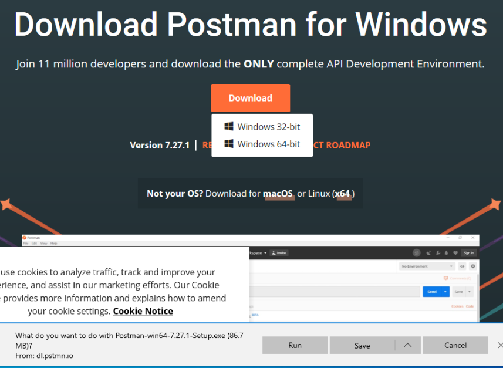
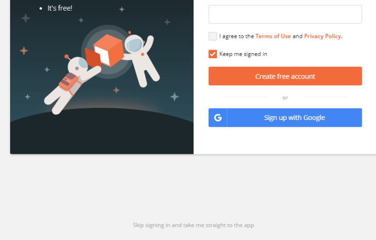

.. _postman-installation:

.. index:: ! Postman 

Installing Postman
==================

When exploring and testing a web API, it is invaluable to have an interactive environment that allows you to fine-tune requests. For example, you may need 
to configure the HTTP method, headers, or body of the request -- all of which the browser does not allow you to do. Instead of testing in a browser, 
we can use tools made specifically for interacting with APIs. One of the most popular API tools in the industry is **Postman**. Postman is a cross-platform 
tool that puts you in full control of configuring and executing API requests. 

Installing Postman is easy thanks to its cross-platform nature. You can download the installer on `their downloads page <https://www.postman.com/downloads/>`_. 

**Windows Users**: Select the *Windows x64* installer download then run the installer:

   Windows user should select the *Windows 64-bit* download option

After installation, if Postman does not open automatically, locate the download and open it manually. Making an account can be useful, but if you do not 
want to create one, select the link in grey at the bottom of the splash screen that reads: "Skip signing in and take me straight to the to the app":

   You may skip the step to create an account 

.. admonition:: Tip

   **Windows Users**: Once installed, you can right-click the Postman icon and pin it to your taskbar for easy access in the future:

   .. figure:: figures/pin-taskbar.png
      :alt: User pins the Postman application to their taskbar on Windows

   Pinning the Postman application to your Windows taskbar could make your life easier

You can leave the launchpad view open for now. We will explore Postman after setting up our API server.

.. figure:: figures/launchpad-view.png
   :alt: Postman launchpad view, contains overview of initial actions a user can make with the software

   Now that Postman is installed, there are a lot of features of the software to explore