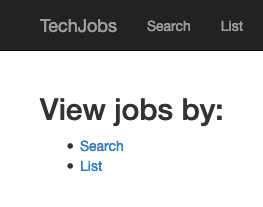

.. _tech-jobs-mvc:

Assignment #3: Tech Jobs (MVC Edition)
======================================

Introduction
------------

Your first two tasks as an apprentice went well! You, Blake, and Sally built
the TechJobs console prototype and then refactored the code to move it to an
object-oriented format.

After demonstrating the prototype for the Company Team at LaunchCode, it
received the green light to be fully built out as a web application.

.. index:: ! minimum viable product

The first step in this process will be to quickly develop a `minimum viable
product <https://en.wikipedia.org/wiki/Minimum_viable_product>`__, or MVP. The
goal is to get a functioning web app up and running with as little work as
possible. That way, additional feedback and testing can be done early in the
development process. After that, additional behind-the-scenes work will be
carried out to fully develop the model and data side of the application.

For this next step in the project, you’ll be working with Carly.

.. figure:: figures/LC-Carly.png
   :scale: 55%
   :alt: Carly's LaunchCode avatar.

Carly was once a LaunchCode apprentice as well, so she knows just what
it’s like to be in your shoes. She’s done some initial work on the
project and left you some ``TODO`` tasks that she knows you can handle.

Learning Objectives
-------------------

In this project, you’ll show that you can:

#. Read and understand code written by others.
#. Work within the controller and view portions of an ASP.NET application.
#. Use Razor syntax to display data within a view.
#. Create new handler methods to process form submission.

TechJobs (MVC Edition)
----------------------

You’ll start with some code that Carly has provided. The idea behind your
current assignment is to quickly deliver a functioning ASP.NET application,
so you’ll focus on the controllers and views.

In order to do this, you’ll be reusing the ``JobData`` class and
``job_data.csv`` file from the console app. You will eventually have to go back
and rewrite the data portion of the application to make a true, database-backed
model. However, using the existing ``JobData`` class to provide some basic data
functionality lets you focus on the views and controllers for now.

Your Assignment
---------------

The list below provides a general overview of your assigned tasks. Specific
details for each part appear in the following sections, so be sure to read them
carefully as you solve each problem.

#. Review Carly’s code in the ``JobData`` file as well as in the existing
   controllers and views.
#. As her next step, Carly created two basic templates to show lists of jobs
   for each field of the data (``employer``, ``location``, etc.). You will need
   to add some details to these views to allow users to select and display jobs
   stored in the system.
#. Finally, Carly started working on the search feature, but only got as far as
   writing the code to display the search form. She’s handed the project to you
   to finish the rest. You’ll add code to the controller and view to process
   and display and search results.

Getting Started
----------------

Set up a local copy of the project:

#. Visit the `repository page <https://github.com/LaunchCodeEducation/TechJobsMVC>`__
   for this project. Fork the repository to create a copy under your own GitHub
   account.
#. Open the project in Visual Studio.

.. admonition:: Tip

	**Windows Users**: You might need to change some solution settings if you pull down this demo repository and run it on your computer.
	Refer to :ref:`vs-troubleshooting` for help.

#. Launch the application so you can refer to both the code as well as the running app
   as you complete the assignment.

1) Review the Code
-------------------

.. admonition:: Tip

   One essential programming skill that you will develop is the ability to read
   and understand someone else's code. This assignment begins with you
   practicing exactly that. Make sure you carefully examine the provided code
   BEFORE you start changing things.

   Trying to change a code sample before understanding how it works leads to
   confusion, frustration, and a broken program. DO NOT SKIP the code review!

Carly created an ASP.NET MVC application and filled in some features. She
refactored ``JobData`` to generate a list of ``Job`` objects based on
your TechJobsOO work. She added controllers and views for *Home*,
*List*, and *Search* pages. ``JobData`` now also builds lists for the
``Employer``, ``Location``, ``PositionType``, and ``CoreCompetency`` objects.

The Model
^^^^^^^^^

The ``Models`` directory contains an abstract class definition for ``JobField``. The ``Employer``, 
``Location``, ``PositionType``, and ``CoreCompetency`` classes all inherit from ``JobField``. 
model classes for all of the job fields and for the ``Job`` class itself.  

The Data
^^^^^^^^

The ``JobData`` class in the ``Data`` directory serves the same purpose as before---it reads data from
the ``job_data.csv`` file and stores it in a format we can use. In this case,
that format is a list of ``Job`` objects. 

You’ll use some of the static methods provided by ``JobData`` in your
controller code. Since you’re already familiar with these, we’ll leave it to
you to review their functionality as you go.

The Controllers
^^^^^^^^^^^^^^^

You’ll see that you have three controllers already in place in your ``Controllers`` directory. 
Let’s look at these one at a time.

The ``HomeController``
~~~~~~~~~~~~~~~~~~~~~~

This class has only one action method, ``Index``. The action method displays the home page
for the app. The controller renders the ``Index.cshtml`` template (in
``Views/Home/``) and provides a fairly simple view.

   TechJobs MVC home page with menu options for search and list views.

The ``ListController``
~~~~~~~~~~~~~~~~~~~~~~

This controller provides functionality for users to see either a table showing
all the options for the different ``Job`` fields (``Employer``, ``Location``,
``CoreCompetency``, and ``PositionType``) or a list of details for a selected
set of jobs.

If you look at the corresponding page at ``/list``, you’ll see an "All" column
in the table. However, this option doesn’t work yet, and you will fully
implement that view as you work on the assignment.

At the top of ``ListController`` are two collections, ``ColumnChoices`` and ``TableChoices``. 
These dictionaries play the same role as in the console app, which is to provide a centralized collection
of the different *List* and *Search* options presented throughout the user
interface.

``ListController`` also has two action methods. The first method, ``Index``,
renders a view that displays a table of clickable links for the different job
categories. The second method, ``Jobs``, renders a different view that displays
information for the jobs that relate to a selected category. Both of the
action methods obtain data by implementing the ``JobData`` class methods.

In the ``Jobs`` method, the controller uses two query
parameters passed in as ``column`` and ``value`` to determine what to fetch
from ``JobData``. In the case of ``"all"``, it will fetch all job data.
If the ``column`` parameter is any other value, the method will retrieve a smaller set of information. 
The controller then renders the ``List/Jobs`` view. We’ll explore the ``List`` and
``List/Jobs`` templates in a moment.

The ``Jobs`` action method works similarly to the search functionality, in
that we are searching for a particular value within a particular field and
then displaying jobs that match. However, this is slightly different from the
other way of searching. This action method is called as a
result of clicking on a link within the ``List`` view, rather than via
submitting a form. We’ll see where these links originate when we look at the
views. 

The ``SearchController``
~~~~~~~~~~~~~~~~~~~~~~~~

Currently, the search controller contains only a single action method, ``Index``.
It simply renders the form defined in the ``Views/Search/Index.cshtml`` template.

Later in this assignment, you will receive instructions for adding a second
action method to deal with user input and display the search results.

The Views
^^^^^^^^^

Let’s turn our attention to the views.

Bootstrap Classes
~~~~~~~~~~~~~~~~~

The application uses a few Bootstrap classes to style the view content and
job tables. You won’t have to explicitly add any Bootstrap classes to your views in this assignment,
but it’s a great way to make your sites look good with minimal work.

The List Views
~~~~~~~~~~~~~~

Turn your attention to ``List/Index.cshtml``. This page displays a table of links
broken down into several categories. Data from ``ListController.ColumnChoices`` is used to
fill in the header row, and information stored in ``ListController.TableChoices`` generates
the link text.

The most interesting part of this template is how we generate the links:

.. sourcecode:: html
   :lineno-start: 17

   @foreach (var category in ViewBag.tableChoices)
   {
      <td>
         <ul>
            @foreach (var item in category.Value)
            {
               <li>
                  <a asp-controller="List" asp-action="Jobs" asp-route-column="@category.Key" asp-route-value="@item">@item</a>
               </li>
            }
         </ul>
      </td>
   }

#. ``ViewBag.tableChoices`` is the ``TableChoices`` dictionary from ``ListController``. It contains the names of
   the ``Job`` fields as keys (``employer``, etc.). The value for each key is
   a list of ``Employer``, ``Location``, ``CoreCompetency``, or
   ``PositionType`` objects.
#. In line 17, ``category`` represents one key/value pair from
   ``TableChoices``, and in line 21, ``item`` represents one entry from the
   stored list.
#. We’ve seen the ASP.NET action tag helpers ``asp-controller`` and ``asp-action`` before. Here, we have a couple new helper tags,
   ``asp-route-column`` and ``asp-route-value``. This syntax, ``asp-route-*`` allows Razor
   to dynamically generate query parameters for our URL. So whatever string takes the place of the last portion of the tag, in our case, 
   ``-column`` and ``-value`` become the names of the query parameters the ``ListController.Jobs`` action method uses.

   .. admonition:: Tip

      Try clicking on a few of these links to help grasp the new syntax. Clicking on one of these ``<a>`` elements 
      routes the app to a page at a URL that looks like this: 
      
      https://localhost:5001/List/Jobs?column=employer&value=Buzzbold.

Clicking on one of the links will display a list of jobs that relate to the
choice, via the ``Jobs`` action method. However, that
view, ``List/Jobs.cshtml`` isn’t working yet. While the action method is fully
implemented, the view template needs some work.

For now, click one of the the *Location* links. This sends a request as we
outlined above, but doing so only displays a page with a title and no job list.

The page you see at ``/List/Jobs?column=location&value=...`` is generated by
the ``List/Jobs`` template. It will have a similar structure to ``List/Index``,
but with a table that consists of only one column.

.. admonition:: Note

   Select "Kansas City" from the list of locations, and then check the address
   bar of your browser:

   .. sourcecode:: bash

      /list/jobs?column=location&value=Kansas%20City

   Razor inserts ``%20`` for us, to represent a space, but this may
   actually be hidden in your browser’s address bar.

The Search View
~~~~~~~~~~~~~~~

Finally, click on *Search* from the home page, or the navigation bar, and open
up ``Views/Search/Index.cshtml`` in Visual Studio. You’ll see a search form (in both the browser
and template file) that gives the user the option of searching by a given
``Job`` field, or across all fields. This is an exact visual analog of our
console application.

This template will be used to display search results, in addition to rendering
the form. This will give the nice user experience of easily searching multiple
times in a row.

Wrap Up the Code Review
^^^^^^^^^^^^^^^^^^^^^^^^

Once you understand the controllers and views that are already in place, you’re
ready to begin your work.

Pop open a small pane in your editor to 
view your ``TODOs`` for this assignment. 

**Windows Users**: In Visual Studio, select *View > Task List*.
**Mac Users**: In Visual Studio, select *View > Pads > Tasks*.

You’ll see your tasks listed, and clicking on any one will
open the relevant file.

.. figure:: figures/techJobsTodos.png
   :alt: TechJobs MVC TODO list in Visual Studio Task Pad.

   TechJobs MVC TODO list in Visual Studio Task Pad.

2) Complete the List Views
--------------------------

Open the ``Views/List/Jobs.cshtml`` template. Currently, the page just establishes the
navigation bar and page title. You need to add code that will present relevant
job information.

Display List of Jobs
^^^^^^^^^^^^^^^^^^^^

This page needs to show full job listings---ID, employer, location, etc.

#. In ``Views/List/Jobs.cshtml``, create a loop to display each job passed in from the
   controller. The job data should be presented in a *table*. Be sure to check
   in ``ListController`` to find the variable names available to the template.
#. Adding the CSS class ``"job-listing"`` to a table provides some nice
   styling, courtesy of Carly’s work!
#. Construct one table, putting each job in a separate row with the fields on
   separate lines. Alternatively, you can put each job in its own table, with
   one job field per row.

   .. figure:: figures/list-jobsTableOptions.png
      :alt: Image of the two table options.
      :scale: 70%

      The two table options.

#. Be sure to test your code by running the program and clicking links from
   different categories on the ``/list`` page.

   a. Clicking the *Web - Back End* link yields 6 jobs.
   b. *iOS* yields 4 jobs.
   c. *New York* yields 1 job.
   d. Etc.

Add ``View All`` Link
^^^^^^^^^^^^^^^^^^^^^

Open the ``list.html`` template. This file builds the table to display all of
the links for the different ``Job`` fields. However, the link for the ``All``
column is missing.

   The ``/list`` table showing hyperlinks in each column but "All".

Modify ``Views/List/Index.cshtml`` to fill in the empty table cell with the necessary
link. Check ``ListController`` to help identify the data to pass in for the
``asp-route`` tag helpers.

Be sure to test your code by clicking your new *View All* link in the table.
There are 98 jobs in the data file.

3) Complete the Search Functionality
------------------------------------

Add an action method named ``Results`` to ``SearchController``:

#. To configure the correct mapping for this method to be called when the 
   ``Search/Index`` form is submitted, do not name this method anything other than ``Results``.
#. The ``Results`` method should take in two parameters, specifying the type of
   search and the search term.
#. In order for these parameters to be properly passed in by ASP.NET, 
   you need to name them appropriately, based on the corresponding form field names defined in
   ``Search/Index``.
#. If the user leaves the search box empty,
   call the ``FindAll()`` method from ``JobData``. Otherwise, send the search
   information to ``FindByColumnAndValue``. In either case, store
   the results in a ``jobs`` list.
#. Pass ``jobs`` into the ``Search/Index`` view via ``ViewBag``.
#. Pass ``ListController.ColumnChoices`` into the view, as the existing
   ``search`` handler does.

Display Search Results
^^^^^^^^^^^^^^^^^^^^^^

Once you have your ``Results`` action method passing information to the
view, you need to display the data.

#. In ``Search/Index``, create a loop to display each job passed in from the
   controller.
#. Put the job results into a table, similar to what you did for the
   ``List/Jobs`` view.

.. admonition:: Tip

   You can *reuse* the code you just wrote in ``List/Jobs.cshtml`` by copying
   and pasting.

   For the fragment to work properly in both files, the ``ViewBag`` properties must use the same name.

Sanity Check
------------

Before submitting, make sure that your application:

#. Displays all 98 jobs in the system when the user goes to the ``/list`` page
   and selects "All".
#. Displays all jobs matching a particular category when the user selects a
   specific employer, location, skill, or position type from the ``/list``
   page.
#. Displays jobs with alternating white and gray backgrounds (this is provided
   by the ``"job-listing"`` class).
#. Allows a user at ``/search`` to search for jobs matching a specific search
   term, both within a specific category and across all categories.
#. Displays search results below the form at ``/search/results``.

How to Submit
--------------

To turn in your assignment and get credit, follow the
:ref:`submission instructions <how-to-submit-work>`.

Bonus Missions
--------------

Here are some additional challenges, for those willing to take them on:

#. When we select a given field to search within and then submit, our choice is
   forgotten and returns to "All" by default. Modify the view template to keep
   the previous search field selected when displaying the results.
#. In the tables of the job results, make each value (except ``name``)
   hyperlinked to a new listing of all jobs with that same value. For example,
   if we have a list of jobs with the ``JavaScript`` skill, clicking on a
   location value like ``Saint Louis`` will generate a new list with all the
   jobs available in that city.

