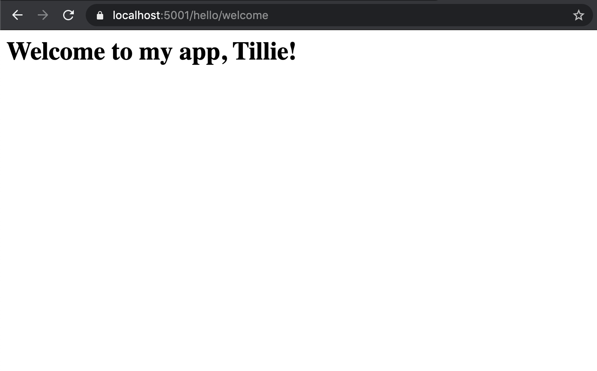

Controllers with Forms
======================

Sending Form Data - Video
-------------------------

.. youtube:: 
   :video_id: t2snajyFFzc

.. admonition:: Note

   If you ever want to verify what code you started this video with, the `starter code <https://github.com/LaunchCodeEducation/HelloASPDotNETDemo/tree/query-parameters>`_ for this video is on the ``query-parameters`` branch.
   If you ever want to verify what code you end this video with, the `final code <https://github.com/LaunchCodeEducation/HelloASPDotNETDemo/tree/forms>`_ for this video is on the ``forms`` branch.  

Sending Form Data - Text
-------------------------

What if we want to send over some form data?
To send data via a simple form in ASP.NET, we'll set things up like this:

We have an action method that generates a form at index and responds to a ``GET`` request. 
We will modify the ``Index()`` method we have already written like so and comment out any attributes we have been using:

.. sourcecode:: csharp
   :linenos:

   public IActionResult Index()
   {
      string html = "<form method='post' action='/hello/welcome'>" +
         "<input type='text' name='name' />" +
         "<input type='submit' value='Greet Me!' />" +
         "</form>";

      return Content(html, "text/html");
   }

With conventional routing, we know that the ``Index()`` method currently responds to ``localhost:5001/hello``.
On form submission, we want to send the data down another path, ``/hello/welcome``, which we specified in the ``action`` attribute in the ``form`` tag.
This is the path to our ``Welcome()`` method.
On line 4 above, we have given the text input the same name as the argument of the ``Welcome()`` method, which happens to be ``name``.
By giving the route to the ``Welcome()`` method in ``action``, specifying ``POST`` as the ``method`` attribute, and matching the argument to the input, we have set up the ``Welcome()`` method to handle the form submission.

With the ``Index()`` method rewritten and our ``Welcome()`` method handling form submission, we can run our app and see what happens!

.. figure:: figures/filledoutform.png
   :alt: Webpage with filled out form 

   New form filled out with the name "Tillie"

Once we hit *Greet Me*, the value of ``name``, ``"Tillie"``, is submitted to the ``Welcome()`` method.

   The result of submitting the form

With our form working, we can add some attribute routing to streamline our code and specify routes and request types.
For the ``Index()`` method, we want the method to respond to a ``GET`` request at ``localhost:5001/helloworld``.

.. sourcecode:: csharp
   :linenos:

   [HttpGet]
   [Route("/helloworld")]
   public IActionResult Index()
   {
      string html = "<form method='post' action='/hello/welcome'>" +
         "<input type='text' name='name' />" +
         "<input type='submit' value='Greet Me!' />" +
         "</form>";

      return Content(html, "text/html");
   }

Now we also want to add attributes to the ``Welcome()`` method.
``Welcome()`` should respond to a ``POST`` request so we will add an ``[HttpPost]`` attribute.
We also want to use a ``[Route("path")]`` attribute to specify the route to be ``localhost:5001/helloworld/welcome``.

.. sourcecode:: csharp
   :linenos:

   [HttpPost]
   [Route("/helloworld/welcome")]
   public IActionResult Welcome(string name = "World")
   {
      return Content("<h1>Welcome to my app, " + name + "!</h1>", "text/html");
   }

Now when we run our app, we can navigate to ``localhost:5001/helloworld`` and see our form.
Once we fill out the form and hit *Greet Me!*, the app redirects to ``localhost:5001/hello/welcome`` and breaks.
We didn't update ``action`` in our ``<form>`` tag in the ``Index()`` method.
Once we change the value of ``action`` to ``/helloworld/welcome``, we can re-run our app and see it fully functioning.

.. admonition:: Note

   The ``Welcome()`` method can respond to a ``POST`` request and the ``Index()`` method can respond to a ``GET`` request at the same URL.
   To make this happen, we change the route in the ``action`` attribute in the ``<form>`` tag and change the route in the ``[Route("path")]`` attribute above the ``Welcome()`` method to ``/helloworld``.
   Re-running the app, we can submit the form and the page reloads to display our welcome message.

Check Your Understanding
------------------------

.. admonition:: Question

   Which type of request should the ``Index()`` method respond to?
 
   a. ``GET`` request
      
   b. ``POST`` request

   c. ``PUT`` request

   d. ``DELETE`` request

.. ans: a

.. admonition:: Question

   Which type of request should the ``Welcome()`` method respond to?
 
   a. ``GET`` request
      
   b. ``POST`` request

   c. ``PUT`` request

   d. ``DELETE`` request

.. ans: b

.. admonition:: Question

   True/False: two different action methods cannot respond to different request types at the same URL.

.. ans: False, they can!