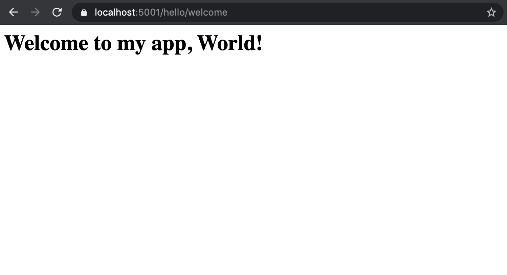

Controllers with Parameters
===========================

Now that you know the basics of action methods and controllers, we can start to add some more variables into the mix.
Some action methods can take in parameters in the form of query strings or sections of the URL path.
Passing this URL data to the controller is one step closer to more flexible web applications. 

On the previous page, we learned that a route is the mechanism by which a request path gets assigned to a controller within our application.
In this section, we’ll further explore routes and how data is transferred from a webpage with a given route to a specific controller.

.. index:: ! query string

Query Strings are URL Data
--------------------------

A brief refresher: **query strings** are additional bits of information tacked onto the ends of urls.
They contain data in key-value pairs.

::

   www.galaxyglossary.net?aKey=aValue&anotherKey=anotherValue&thirdKey=thirdValue

Controllers and Query Parameters - Video
-----------------------------------------

.. youtube::
   :video_id: CQ8WB7-oy4o

.. admonition:: Note

   If you ever want to verify what code you started this video with, the `starter code <https://github.com/LaunchCodeEducation/HelloASPDotNETDemo/tree/static-responses>`_ for this video is on the ``static-responses`` branch.
   If you ever want to verify what code you end this video with, the `final code <https://github.com/LaunchCodeEducation/HelloASPDotNETDemo/tree/query-parameters>`_ for this video is on the ``query-parameters`` branch.

Controllers and Parameters - Text
---------------------------------

Query Strings
^^^^^^^^^^^^^

We can pass different parameters into an action method.
Let's add a method called ``Welcome()`` to ``HelloController.cs``. 

.. sourcecode:: csharp
   :linenos:

   // GET: /<controller>/welcome
   public IActionResult Welcome(string name)
   {
      return Content("<h1>Welcome to my app, " + name + "!</h1>", "text/html");
   }

Right now, the ``Welcome()`` method is using conventional routing, so it will respond to requests at ``localhost:5001/hello/welcome``.
The ``Welcome()`` method has one argument, ``name``. However, when we run the app and navigate to ``localhost:5001/hello/welcome``, we can see that ``name`` has no value.

.. figure:: figures/nodefaultvalue.png
   :alt: Simple webpage that only displays Welcome to my app.

``name`` does not receive a value from anywhere, so to start, we need to pass ``name`` a value.
We can do so with a query string. ``name`` will act as the key and the value will be ``"Tillie"``.
Let's navigate to ``localhost:5001/hello/welcome?name=Tillie``. 
Now the webpage displays a simple string of HTML that says "Welcome to my app, Tillie!".

When we are adding arguments to an action method, we need to not only think about the request type and route, we need to think about where those variables are going to get values.
Here we were able to give a value to that argument in the URL itself with a query string. 
However, when working with query strings, we want to provide a value to ``name`` in case the user navigates to a URL without a query string.

We can do so by modifying the method signature slightly.

.. sourcecode:: csharp
   :linenos:

   // GET: /<controller>/welcome
   public IActionResult Welcome(string name = "World")
   {
      return Content("<h1>Welcome to my app, " + name + "!</h1>", "text/html");
   }

On line 2, we give the argument, ``name``, a value of ``"World"``.
We do this to make ``name`` an **optional parameter**.
Optional parameters are designated with a default value (in our case, ``"World"``) and method calls do not have to include a value for that parameter.
When working with query strings, it is wise to make the key an optional parameter in case no value is provided for it.
If a query string is not provided and we navigate to just ``localhost:5001/hello/welcome``, then our webpage will display "Welcome to my app, World!".

   Our webpage when we don't provide a query string.

Now, we can dive into using attribute routing to get ``Welcome()`` to respond at the same route and to a ``GET`` request.
We know from our experiment above we can do this without attributes, but we want to be specific in our routes and the request type.
First, we need to add a ``[HttpGet]`` attribute to specify that our method responds to a ``GET`` request.
We also want to specify the path with the ``[Route]`` attribute.

.. sourcecode:: csharp
   :linenos:

   [HttpGet]
   [Route("/helloworld/welcome/{name}")]
   public IActionResult Welcome(string name = "World")
   {
      return Content("<h1>Welcome to my app, " + name + "!</h1>", "text/html");
   }

When writing the path for our ``[Route("path")]`` attribute, we have surrounded ``name`` in curly braces.
The use of curly braces in the path portion of the attribute means that we don't want to use the word "name" in the route, but the value of the variable, ``name``.
If we ran the app now and navigated to ``localhost:5001/helloworld/welcome`` or ``localhost:5001/helloworld/welcome?name=Tillie``, the webpages are not found.
We have given ``name`` a default value in the method signature, however, we have to designate in the *path* inside ``[Route("path")]`` that ``name`` is optional.
When we do so, we are making the action method more flexible so it can respond at ``localhost:5001/helloworld/welcome`` or ``localhost:5001/helloworld/welcome?name=Tillie``.
In attribute routing, if we want to designate a parameter as optional, we will use a ``?`` after the variable name like so:

.. sourcecode:: csharp
   :linenos:

   [HttpGet]
   [Route("/helloworld/welcome/{name?}")]
   public IActionResult Welcome(string name = "World")
   {
      return Content("<h1>Welcome to my app, " + name + "!</h1>", "text/html");
   }

Adding the ``?`` in the curly braces after ``name`` designates that portion of the path as optional.
If we don't provide a query string, the webpage will display the classic "Welcome to my app, World!".
If we do provide a query string, we will see the resulting page:

.. figure:: figures/queryparamused.png
   :alt: Simple webpage displaying welcome to my app, Tillie

   The end result

.. index:: ! path variable, ! route parameter

Path Variables
^^^^^^^^^^^^^^

Above, we briefly mentioned that some controller methods could take in parameters in the form of a section of a URL path.
These types of parameters are called **path variables**.
Path variables differ from query strings in that the data is not passed in as a key-value pair and that a path variable is a portion of the URL path.
Query strings are a separate component of a URL that occurs after a ``?`` and are separate from the path.
When using a path variable, instead of typing the name of a variable into the path, we type the value we want to pass to the action method at that route.

When we added the ``[Route("/helloworld/welcome/{name?}")]`` attribute to the ``Welcome()`` method, we made it possible for the ``Welcome()`` method to respond to requests at ``localhost:5001/helloworld/welcome/Tillie``.
In that route, ``name`` is used as a path variable and passed the value of ``Tillie`` in the path, displaying the following webpage.

.. figure:: figures/pathvariables.png
   :alt: Webpage displaying welcome to my app, Tillie

   The result when we use ``name`` as a path variable

Diving into the mechanics of how this worked, we remember that enclosing ``name`` in curly braces specifies that we want to use the value of ``name``, not the word "name".
While path variables and query strings are drastically different, the two share a similarity.
Both path variables and query strings allow us to give an action method a value for a parameter as part of a URL.
This is because ``name`` is a **route parameter**.
A route parameter is a portion of the route (which encompasses both the path and the query string) that is passed from the route to the action method.
While our controllers and applications are still small, the differences between a query string and a path variable may seem negligible.
However, as applications become larger and controllers more complex, the different use cases for path variables and query strings will become clear.

.. admonition:: Note

   Before moving on, make sure to add info about the different routes the method maps to in comments in your code!

Check Your Understanding
------------------------

.. admonition:: Question

   Your application is served at ``myfavoriteplanets.net``. What is the path 
   that this controller maps to?

   .. sourcecode:: csharp
      :linenos:

      [HttpGet]
      [Route("/venus/{terrestrial?}")]
      public IActionResult VenusSurface(string terrestrial)
      {
         if (terrestrial == true)
         {
            return "Venus is rocky."        
         }
         else
         {
            return "Venus is gaseous."
         }
      }
 
   a. ``myfavoriteplanets.net/venus?terrestrial=true``
      
   b. ``net.myfavoriteplanets/venus?terrestrial=true``

   c. ``myfavoriteplanets/venus?terrestrial=true``

   d. ``myfavoriteplanets/venus/terrestrial``

.. ans: a, myfavoriteplanets.net/venus?terrestrial=true

