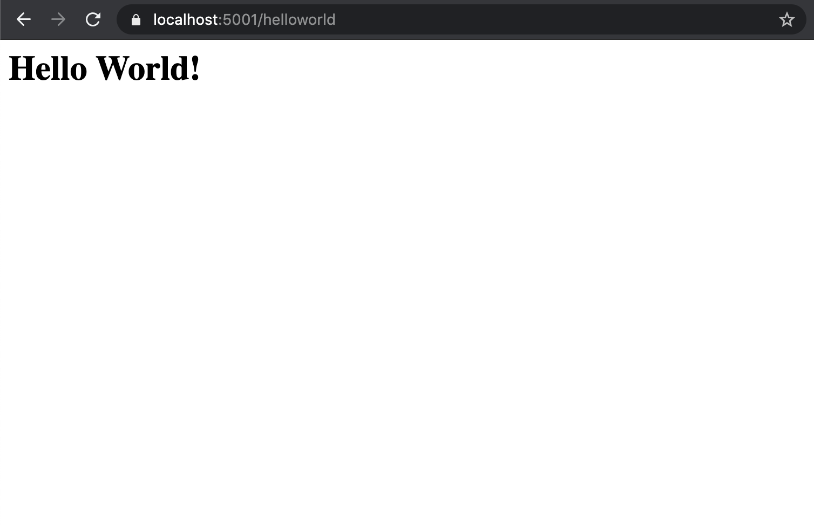

.. index:: ! route

Simple Controllers
==================

The first of the MVC elements we'll work on implementing are the controllers. Recall that controllers 
are like the traffic cops of our application. They handle the requests made from users interacting with the 
application's view and update model data accordingly. Conversely, changes to model data are sent to the view 
via controller methods. When the client issues an HTTP request via a URL, we want to make sure that the URL leads to the correct controller so we get an appropriate response.
A **route** is the mechanism by which a request path gets assigned to a controller within our application.

.. figure:: figures/mvcOverviewDetail.png
      :scale: 50%
      :alt: MVC Flow Diagram showing controllers in the middle passing data between the view and the model

      MVC Flow

.. admonition:: Note

   Do HTTP requests and responses feel unfamiliar?
   If you're feeling rusty on these topics, it's a good idea to brush up now, as routing requires a foundational understanding of HTTP data transfer.

   Here's our `introduction to HTTP <https://education.launchcode.org/intro-to-professional-web-dev/chapters/http/index.html>`__ 
   for reviewing the concepts.

Controllers and Static Responses - Video
----------------------------------------

.. youtube::
   :video_id: wpk2q5zOIG0

.. admonition:: Note 

   If you ever want to verify what code you started this video with, the `starter code <https://github.com/LaunchCodeEducation/HelloASPDotNETDemo>`__ for this video is on the ``master`` branch.
   If you ever want to verify what code you end this video with, the `final code <https://github.com/LaunchCodeEducation/HelloASPDotNETDemo/tree/static-responses>`__ for this video is on the ``static-responses`` branch.

Controllers and Static Responses - Intro
----------------------------------------

.. index:: ! Controller

``Controller``
^^^^^^^^^^^^^^

In ASP.NET, we'll organize controller code into the provided ``Controllers`` directory.
Some tools may depend on us following the convention of the MVC design pattern, so it is important to put our controller code in this directory. 
If you want to change something about the provided structure, be sure to double check the documentation to make sure a tool does not depend on you following it!

To designate a given class as a controller within the ASP.NET framework, we extend the ``Controller`` class.
The `Controller class <https://docs.microsoft.com/en-us/dotnet/api/microsoft.aspnetcore.mvc.controller?view=aspnetcore-3.1>`__ provides us with the necessary members and methods to manage traffic between the three components in our MVC application. 

.. sourcecode:: csharp

   public class HelloController : Controller
   {

      // class code here ...

   }

.. index:: ! endpoint, ! route, ! routing, ! conventional routing, ! attribute routing. ! action method, attribute

Controllers Map to Requests
^^^^^^^^^^^^^^^^^^^^^^^^^^^

Controllers need to handle HTTP requests coming in and routes are a key component of that process.
ASP.NET MVC has two different ways to map these routes: conventional routing and attribute routing.
**Conventional routing** establishes the routes as endpoints in one of the application's configuration files.
**Attribute routing** establishes the routes using :ref:`C# attributes <csharp-attributes>` that are placed in the controller file.

Routes in conventional routing are setup via endpoints in a configuration file called ``Startup.cs``.
When an HTTP request comes in, routing matches the request with an endpoint.
**Endpoints** designate the controller action that executes when the appropriate HTTP request comes into the application.

When we created a new ASP.NET application, without adding any code, we were immediately able to run it.
This is because the MVC application we start out with already has the routing and endpoints set up.
When we open the application, we see in the ``Controllers`` directory that Microsoft has a preconfigured ``HomeController``.
Straight out of the box, ASP.NET is set up to use conventional routing with a configured default route that maps to the ``HomeController``.
While the default route maps to ``localhost:5001``, when we are using conventional routing, our routes follow the same general pattern:

:: 

   localhost:5001/<controller>/<action>

This pattern is key in conventional routing and something to commit to memory. 
To see the result of any given action method in a controller, we can count on this pattern.
Navigating to ``localhost:5001/home/index``, we see the result of the ``Index()`` method, a view.
If we added a new method, ``Hello()``, to the ``HomeController``, we would see the result of that method at ``localhost:5001/home/hello``.

.. admonition:: Note

   Throughout this book, we will be using attribute routing to break the pattern established by conventional routing.
   However, if you want to investigate further on how to use an endpoint for a rule-breaking route in conventional routing, Microsoft has a great `article <https://docs.microsoft.com/en-us/aspnet/core/mvc/controllers/routing?view=aspnetcore-3.1#special-case-for-dedicated-conventional-routes>`_ on the subject.
   For example, endpoints preconfigured in ``Startup.cs`` is how we can navigate to ``localhost:5001`` and ``localhost:5001/Home/Index`` to see the same page.

When adding a new controller, such as ``HelloController``, we need to make sure that routing is properly configured whether we use conventional routing or attribute routing.
We want to start by adding a new action method to ``HelloController``.
**Action methods** are the public methods in a controller class.
Action methods respond at a specific route and that response can be an update to a view, sending new data to a model, returning some simple HTML, and so on.
When we are creating a new action method, we want to think about what route the method needs to respond at, what request type the action method should respond to, and what that response entails.
Let's start by adding the following ``Index()`` method:

.. sourcecode:: csharp
   :linenos:

   // GET: /<controller>/
   public IActionResult Index() 
   {
      string html = "<h1>" + "Hello World!" + "<h1>";
      return Content(html, "text/html");
   }

Every time you add a new action method, you should write a comment above it to make note of the route that you want the method to respond to and the type of request that it should respond to at that route.
With conventional routing, the action methods can respond to different types of requests at the given route.
So even though we made a note that we want the ``Index()`` method to respond to ``GET`` requests at the route, ``localhost:5001/hello``, the ``Index()`` method could also respond to a ``POST``, ``PUT``, or ``DELETE`` request at that route.
Attribute routing is a way for us to specify which request type the method can respond to.
But for now, let's run the app and navigate to ``localhost:5001/hello`` to check our work.

.. admonition:: Warning

   Conventional routing makes use of the controller's name and action method's name.
   If you mistype either in the URL when testing out your application, you will run into an error.

We also want to make use of attribute routing in our new ``HelloController``.
To do so, we can add attributes to our ``Index()`` method.
As you may recall from the :ref:`chapter <csharp-attributes>` on unit testing, attributes in C# lie somewhere between code and comments.
While an attribute cannot change the code inside the method or class, an attribute in attribute routing does supply critical information about routes and request types.
Attribute routing is powerful because it does not depend on any endpoint mapping info in ``Startup.cs``, can defy the pattern established by conventional routing, and specify one request type for a method to respond to.

.. admonition:: Note

   ASP.NET has many different attributes that we can use in our controllers.
   For a more in-depth catalog of different attributes, check out the `documentation <https://docs.microsoft.com/en-us/aspnet/core/mvc/controllers/routing?view=aspnetcore-3.1#http-verb-templates>`__.

.. index:: ! [HttpGet], ! [HttpPost], ! [Route("path")]

As we noted above, we want the ``Index()`` method to respond to a ``GET`` request at a specified route.
Every time we write an action method, we should be thinking about what type of request the action method should respond to.
Once we have noted our decision about the request type in a comment, we could add an HTTP verb attribute above the action method.
While we know that our ``Index()`` method can respond to ``GET`` requests at ``localhost:5001/hello``, we should always be adding HTTP verb attributes to action methods for practice.
As our controllers grow in complexity, HTTP verb attributes grow in importance!
We are going to focus on action methods that respond to ``GET`` and ``POST`` requests for now.
An ``[HttpGet]`` attribute is used for action methods responding to ``GET`` requests and an ``[HttpPost]`` attribute is used for action methods responding to ``POST`` requests.

The route we now want to go to see the result of the ``Index()`` method is ``localhost:5001/helloworld``. 
We will use an ``[HttpGet]`` attribute to specify that the method will respond to a ``GET`` request.
We also want to use a ``[Route("path")]`` attribute.
``[Route("path")]`` is used above the action method to establish the route that maps to that method.

Let's see how we can use these attributes in our ``HelloController`` class.

.. sourcecode:: csharp
   :linenos:

   class HelloController : Controller
   {
      [HttpGet]
      [Route("/helloworld/")]
      public IActionResult Index() 
      {
         string html = "<h1>" + "Hello World!" + "<h1>";
         return Content(html, "text/html");
      }
   }

On line 4, you may have noted that we did not include ``localhost:5001`` in the path we used in our ``[Route("path")]`` attribute.
The path portion of a URL is a specific section that comes after the host and port.
If you want a quick refresher on the structure of a web address, check out this `section <https://education.launchcode.org/intro-to-professional-web-dev/chapters/http/how-the-internet-works.html#web-addresses>`__ from our introduction to HTTP.

Now when we run our application, we can head over to ``localhost:5001/helloworld`` to see the result.
If we head over to the route that was mapped through conventional routing, ``localhost:5001/hello``, we will find a broken page.
The result is a simple web page with one heading that says "Hello World!".

   Our end result!

.. admonition:: Note

   While the book focuses on attribute routing, in this chapter, we will map our routes with both approaches.
   Many applications contain a combination of both conventional and attribute routing.
   We encourage you to try out both approaches to make sure that you can recognize and understand both approaches to routing.

Now that our new controller and action method are working, we can take a closer look at the ``Index()`` method.
``Index()`` above returns an unfamiliar type, ``IActionResult``.
We will be using ``IActionResult`` quite a bit in our applications and it is an important interface for us to be aware of.

.. index:: ! IActionResult

``IActionResult``
^^^^^^^^^^^^^^^^^

``IActionResult`` is an interface in the ASP.NET framework and often times the return type of action methods.
When we specify the return type as ``IActionResult``, the returned value dictates what the client will display after the action is complete.
We can use ``IActionResult`` to get the client to display plain text or other data types.
In a later section on views, we will use ``IActionResult`` to return HTML templates.
We will only scratch the surface of what ``IActionResult`` can do so for now, let's focus on ``Content``.
``Content`` is a class that implements the ``IActionResult`` interface.

In our ``Index()`` method, we want to return a simple string of HTML to be displayed on the webpage.
We use ``Content()`` to specify which string we want to use for our content and we specify the content type with ``"text/html"``.
When using ``Content()``, we need to specify the content type in order the page to render how we want it to!

.. admonition:: Note

   For more info on the different types of results we could specify as return types, check out this `article <https://exceptionnotfound.net/asp-net-core-demystified-action-results/>`__!

Check Your Understanding
------------------------

.. admonition:: Question

   True/False: The ``Controller`` class does not have to be extended to classify a class as a controller.
 
   a. True
      
   b. False

.. ans: b

.. admonition:: Question

   Which of the following is true about controllers?
 
   a. Controllers handle the data storage of an MVC app.

   b. Controllers manage what the user of an MVC application sees.

   c. Controllers relay the messages between data and views in an MVC application.

   d. Controllers determine what information can be submitted in an online form.

.. ans: c, Controllers relay the messages between data and views in an MVC application.

