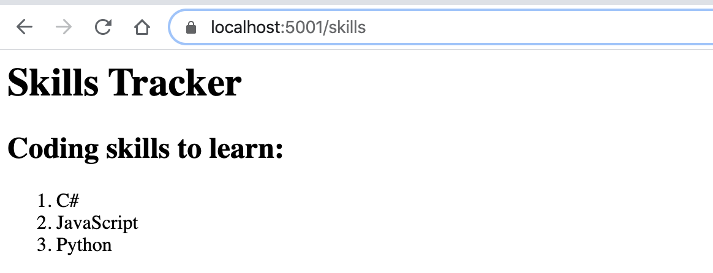
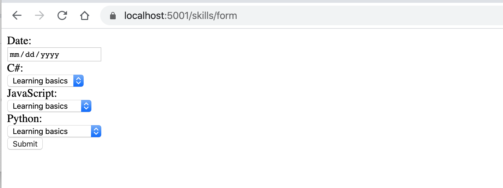
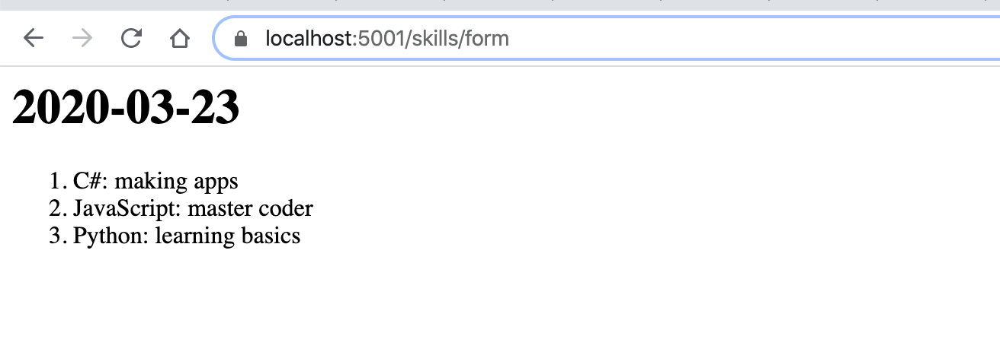

Studio: Skills Tracker
======================

Wouldn't it be nice to have a small tracker to show us what programming skills we are working on?
Let's build something that would let us do just that!

As always, read through the whole studio before starting.

At the end of the studio, your final project should be able to take input from a user via a form and post the information 
in a way that is easy to read.

Create the MVC Project
----------------------

In Visual Studio, create a new ASP.NET project using the *Web Application (Model-View-Controller)* option. Name your 
new project ``SkillsTracker``. Once created, run the project and go to ``localhost:5001`` to ensure that there are no 
underlying build errors to fix before coding. Now you are ready to start tracking skills.

Creating Controllers
--------------------

In your project, add a controller class called ``SkillsController`` inside the ``Controllers`` folder.
Inside ``SkillsController``, you will add several methods to accomplish the following:

#. At ``localhost:5001/skills``, add text that states the three possible programming languages someone could be working on.
   You need to have an ``h1`` with the title "Skills Tracker", an ``h2``, and an ``ol`` containing three programming languages 
   of your choosing.
#. At ``localhost:5001/skills/form``, add a form that lets the user enter a date and choose their learning progress in each of 
   the programming skills listed at ``/skills``.

   .. admonition:: Tip

      Use the `date input type <https://developer.mozilla.org/en-US/docs/Web/HTML/Element/input/date>`__. Note that the value is 
      a ``string`` type. 
      
      For each of the skills, use ``select`` elements for selecting a description of progress. 

#. Also at ``localhost:5001/skills/form``, use ``[HttpPost]`` and request parameters to update the HTML with an ``h1`` stating the 
   submitted date and a list showing the user's learning progress in the three programming languages they chose.

End Result
----------

At the end of the studio, when you navigate to ``localhost:5001/skills``, you should see the following:

   Skill Tracker app home page.

When you navigate to ``localhost:5001/skills/form``, you should see a blank form that looks something like: 

   Skill Tracker app blank skill form.

If you fill out the form, your page may render like so:

   Skill Tracker app result of skill form submission.

Bonus Missions
--------------

#. Reformat your ``form`` page to use a table instead of an ordered list.
#. Add a new path to the site to display the information from the completed form.