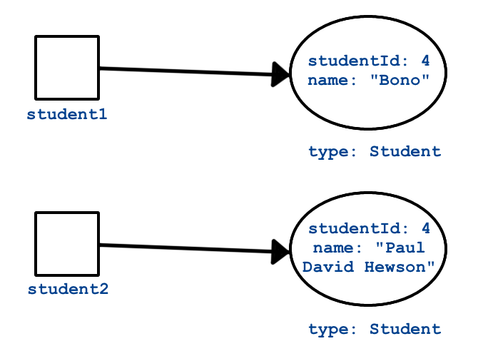
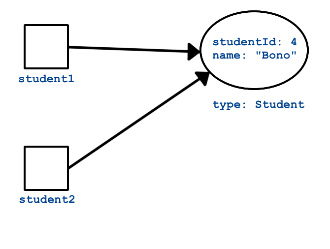

.. _special-methods:

Special Methods
===============

Every class has a few special methods that belong to it, regardless of
whether or not we define them. Exactly *how* every class obtains these
methods will be explored in a future lesson. For now, let’s look at two
important examples of these methods.

``ToString``
-------------

The ``ToString`` method returns a string representation of a class.
Calling ``ToString`` on a class that you’ve written will result in
something like this:

.. admonition:: Example

   .. sourcecode:: csharp
      :linenos:

      Student person = new Student("Violet");
      Console.WriteLine(person.ToString());

Here, we called ``ToString`` on a ``Student`` object. The default ``ToString``
implementation is generally not very useful. Most of the time, you’ll want to
write your own ``ToString`` method. To **override** the default ``ToString``, you can define new behavior for the method and provide
better results.

Here’s how we might do it for ``Student`` to produce a much more friendly
message:

.. admonition:: Example

   .. sourcecode:: csharp
      :linenos:

      public override string ToString() {
         return Name + " (Credits: " + NumberOfCredits + ", GPA: " + Gpa + ")";
      }

      Student person = new Student("Violet");
      Console.WriteLine(person.ToString());

   **Console Output**

   ::

      Violet (Credits: 0, GPA: 0.0)

In the example, we define the ``ToString`` method to return a string that
reports the values of the ``name``, ``numberOfCredits``, and ``gpa`` fields in a
clear manner.

Note that ``ToString`` is often implicitly called for you. For example, the
output above could have been generated by the following code, which calls
``ToString`` on ``person`` within ``Console.WriteLine()``.

.. sourcecode:: csharp
   :linenos:

   Student person = new Student("Violet");
   Console.WriteLine(person);

.. _equals-method:

``Equals``
----------

Suppose we have two objects of type ``Student``, say ``student1`` and
``student2``, and we want to determine if the two are equal. If we try to
compare the objects using ``==``, we will likely get a result we did not expect. This
is because ``student1`` and ``student2`` are
:ref:`reference variables <reference-variable>`, which means they hold a
reference to, or the *address* of, the actual ``Student`` objects. ``student1``
and ``student2`` evaluate as equal only when they have the same memory address.

To state that again: ``student1`` and ``student2`` will be equal (``==``) only
when they refer to, or point at, the exact same object. Consider the example
below, which creates two ``Student`` objects:

.. admonition:: Example

   .. sourcecode:: csharp
      :linenos:

      Student student1 = new Student("Maria", 1234);
      Student student2 = new Student("Maria", 1234);

      Console.WriteLine(student1.Name + ", " + student1.StudentId + ": " + student1);
      Console.WriteLine(student2.Name + ", " + student2.StudentId + ": " + student2);
      Console.WriteLine(student1 == student2);

Even though the objects have the exact same keys and values, ``student1``
and ``student2`` point to different memory locations. Therefore, the ``==``
check returns ``false``.

This is not usually how we want to compare objects. For example, we might want
to consider two ``Student`` objects equal if they have the same name, email, or
student ID.

The ``Equals()`` method determines if one object is equal to another in this
sense. We introduced the method when discussing strings as it is a method on the object class and ``String`` is the object class in C#.

The code below shows how to use ``Equals()`` to compare two students. Note that
they have different names but the same student ID, indicating they are
actually the same student by our definition above.

.. sourcecode:: csharp
   :linenos:

   Student bono1 = new Student("Paul David Hewson", 4);
   Student bono2 = new Student("Bono", 4);

   if (bono1.Equals(bono2)) {
      Console.WriteLine(bono1.Name +
         " is the same as " + bono2.Name);
   }

If we don’t provide our own ``Equals()`` method, the default option only
considers two objects equal if they are the *exact same object*, which means
they point to the same memory address. This is identical to the behavior we see
when using the ``==`` operator: ``bono1 == bono2``.

In the example above, we created two different ``Student`` objects, so the
expression ``bono1.Equals(bono2)`` evaluates to ``false``. In order to compare
two objects based on their *fields*, rather than their memory references,
we need to define our own ``Equals()`` method.

The difference between the comparison carried out by the default ``Equals()``
method (and by the ``==`` operator), and how we would like to compare our
classes, is the difference between *identity* and *equality*.

#. Two objects are *identical* if they both point to the same memory address.
   In essence, they are the same object. If ``object1`` and ``object2`` are
   identical, then changing one property value in ``object1`` also changes
   that value for ``object2``.
#. Two objects are *equal* if the values they store are the same at the time of
   comparison. ``student1`` and ``student2`` point to different memory
   addresses, but their values are all the same. Thus, we can consider them
   equal, even though they are not identical.

.. index:: ! overriding, ! cast

The default ``Equals()`` method and the ``==`` operator test for *identity*,
whereas we want to test for *equality* instead. We can do so by **overriding**
the ``Equals()`` method. We will discuss overriding in more detail later, but
for now just recognize that it involves defining different behavior for an
existing method.

Two things can be considered *equal* even if they do NOT have all the same
values. In the case of the ``Student`` class, we might specify that two
``Student`` objects are equal if they have the same ID numbers. We would then be tempted to
write a new method definition for ``Equals()`` returning the result of comparing one ``studentId`` value to another ``studentId`` value for equality.
Now if we evaluated such a method with ``bono1`` and ``bono2`` we could get a result of true,
since the student IDs match.

One catch of working with ``Equals()`` is that its input parameter must be of
type ``object``, even if we’re working in a class like ``Student``. The reason
why will become more clear in a later lesson, when we introduce the ``object``
class. For now, the practical implication is that we must confirm that we can convert, or **cast**,
the input parameter to be of type ``Student`` with the ``as`` keyword. Then we compare the converted student’s ID
(``bono2.StudentId``) to that of the current student (``bono1.StudentId``).

Here’s a visualization of the concepts of equality and identity:

**Equality**

When you test for equality, you look at two different objects and compare some
aspect of them to each other.

**Identity**

When you test for identity, you look at two variables to see if they reference
the exact same object.

Coding a New ``Equals`` Method
^^^^^^^^^^^^^^^^^^^^^^^^^^^^^^^

You’ll often want to implement ``Equals()`` yourself. When you do, be sure you
understand the best practices around how the method should behave. These are
`a little more involved <https://docs.microsoft.com/en-us/dotnet/api/system.object.equals?view=netframework-4.8/>`__
compared to coding a new ``ToString`` method.

In fact, the ``Equals()`` method we defined above isn’t very good by most
C# programmers’ standards. Let’s improve it.

Problem #1
~~~~~~~~~~~

The method argument cannot be converted to a ``Student`` instance.

When we attempt to cast the argument ``ToBeCompared`` to type ``Student``,
we’ll get an exception if ``ToBeCompared`` can’t be properly converted. This
happens if something other than a ``Student`` object gets passed into
``Equals()``. To prevent this from happening, we’ll return ``false`` if
``ToBeCompared`` was not created from the ``Student`` class. To check this, we
use the ``GetType`` method, which is available to every object (similarly
to ``ToString``).

.. sourcecode:: csharp
   :linenos:

   public override boolean Equals(object toBeCompared) {

      if (toBeCompared.GetType() != this.GetType())
      {
         return false;
      }

      Student s = toBeCompared as Student;
      return s.StudentId == StudentId;
   }

Lines 3 - 6 ensure that the two objects that we want to compare were created
from the same class. Line 8 uses the ``as`` keyword to set a ``Student`` object, called ``s``, to the object when ``toBeCompared`` is cast as type ``Student``.

Problem #2
~~~~~~~~~~~

``toBeCompared`` might be ``null``.

If ``toBeCompared`` is ``null``, then ``toBeCompared.GetType()`` throws an
exception. This is an easy issue to fix---just compare the object to ``null``.
If the comparison evaluates to ``true``, then we know the object is null and
``Equals()`` should return ``false``.

.. sourcecode:: csharp
   :linenos:

   public override boolean Equals(object toBeCompared) {

      if (toBeCompared == null)
      {
         return false;
      }

      if (toBeCompared.GetType() != this.GetType())
      {
         return false;
      }

      Student s = toBeCompared as Student;
      return s.StudentId == StudentId;
   }

Line 3 checks ``toBeCompared`` for ``null``, preventing an error in line 8.
Line 8 checks the class of ``toBeCompared``, preventing an error in line 12.

Problem #3
~~~~~~~~~~~

The two objects to compare are *the same* object (identical).

This is less of a problem and more of a way to improve our ``Equals()`` method.
If ``toBeCompared`` is the same literal object that we are comparing it to,
then we can make a quick determination and save a few checks. 

.. sourcecode:: csharp
   :linenos:

   public override boolean Equals(object toBeCompared) {

      if (toBeCompared == this)
      {
         return true;
      }

      if (toBeCompared == null)
      {
         return false;
      }

      if (toBeCompared.GetType() != this.GetType())
      {
         return false;
      }

      Student s = toBeCompared as Student;
      return s.StudentId == StudentId;
   }

Line 3 checks for identity. If ``true``, then the remaining checks become
unnecessary.

.. _components-of-equals:

Components of ``Equals``
^^^^^^^^^^^^^^^^^^^^^^^^^

Almost every ``Equals`` method you write yourself will look similar to the last example
above. It will contain the following segments in this order:

#. **Reference check:** If the two objects are the same, return ``true``
   right away.
#. **Null check:** If the argument is ``null``, return ``false``.
#. **Class check:** Compare the classes of the two objects to ensure a
   safe cast. Return ``false`` if the classes are different.
#. **Cast:** Convert the argument to the type of our class, so getters
   and other methods can be called.
#. **Custom comparison:** Use custom logic to determine whether or not
   the two objects should be considered equal. This will usually be a
   comparison of class members.

Characteristics of ``Equals``
^^^^^^^^^^^^^^^^^^^^^^^^^^^^^^

Now that we know how to write an ``Equals()`` method, let’s look at some
characteristics that every such method should have. Following the general
outline above makes it easier to ensure that your ``Equals()`` method has these
characteristics.

#. **Reflexivity:** For any non-null reference value ``x``,
   ``x.Equals(x)`` should return ``true``.
#. **Symmetry:** For any non-null reference values ``x`` and ``y``,
   ``x.Equals(y)`` should return ``true`` if and only if ``y.Equals(x)`` also
   returns ``true``.
#. **Transitivity:** For any non-null reference values ``x``, ``y``, and
   ``z``, if ``x.Equals(y)`` returns ``true`` and ``y.Equals(z)``
   returns ``true``, then ``x.Equals(z)`` should return ``true``.
#. **Consistency:** As long as ``x`` and ``y`` do not change,
   ``x.Equals(y)`` should always return the same result.
#. **Non-null:** For any non-null reference value ``x``,
   ``x.Equals(null)`` should return ``false``.

If you think back to what your math classes had to say about equality, then
these concepts will feel familiar.

Using the general approach outlined above to implement ``Equals()`` will
make it easier to meet these characteristics. However, always check your
method! Missing one or more characteristic can be disastrous for your C#
applications.

.. admonition:: Tip

   Seasoned C# developers, will tell you that every time you implement your own version of ``Equals()`` you should also implement your own version of ``GetHashCode()``.
   ``GetHashCode()`` is another special method that every class has.
   Understanding ``GetHashCode()`` would take us a bit far afield at this point, but we would be remiss to not mention it.
   If you want to read more, check out the `documentation <https://docs.microsoft.com/en-us/dotnet/api/system.object.gethashcode?view=netframework-4.8>`_ on the ``GetHashCode()`` method and this `Stack Overflow discussion <https://stackoverflow.com/questions/371328/why-is-it-important-to-override-gethashcode-when-equals-method-is-overridden>`_.
   We will cover how to override ``Equals()`` and ``GetHashCode()`` in the next section using some fun shortcuts in Visual Studio.

Take Away
^^^^^^^^^^

You may not need to write your own ``Equals()`` method for every class you
create. However, as a new C# programmer, remember the following:

   Always use ``Equals()`` to compare objects.

This is especially true when working with objects of types provided by C#,
such as string. A class that is part of C# or a third-party library will
have implemented ``Equals()`` in a way appropriate for the particular class,
whereas ``==`` will only check to see if two variables refer to the same reference location.

Check Your Understanding
-------------------------

.. admonition:: Question

   Given the code:

   .. sourcecode:: csharp
      :linenos:

      public class Pet {

         public string Name { get; set; }

         Pet(string n) {
            Name = n;
         }
      }

      string firstPet = "Fluffy";
      Pet secondPet = new Pet("Fluffy");
      Pet thirdPet = new Pet("Fluffy");

   Which of the following statements evaluates to ``true``?

   #. ``firstPet == secondPet;``
   #. ``secondPet == thirdPet;``
   #. ``thirdPet.Equals(secondPet);``
   #. ``thirdPet.Name == firstPet;``
   #. ``thirdPet.Equals(firstPet);``

.. The correct answer is "thirdPet.Name == firstPet;".

.. admonition:: Question

   We add the following code inside the ``Pet`` class:

   .. sourcecode:: csharp
      :linenos:

      public override boolean Equals(object petToCheck) {

         if (petToCheck == this) {
            return true;
         }

         if (petToCheck == null) {
            return false;
         }

         if (petToCheck.GetType() != this.GetType()) {
            return false;
         }

         Pet thePet = petToCheck as Pet;
         return thePet.Name == Name;
      }

   Which of the following statements evaluated to ``false`` before, but now
   evaluates to ``true``?

   #. ``firstPet == secondPet;``
   #. ``secondPet == thirdPet;``
   #. ``thirdPet.Equals(secondPet);``
   #. ``thirdPet.Name == firstPet;``
   #. ``thirdPet.Equals(firstPet);``

.. The correct answer is "thirdPet.Equals(secondPet);".
