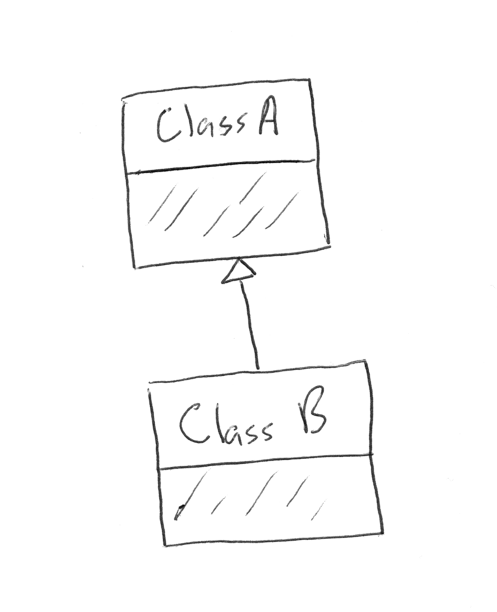

Inheritance in C#
=================

Let's examine an inheritance relationship between two classes: ``Cat`` and ``HouseCat``.
``HouseCat`` is a class that inherits from ``Cat``, so ``HouseCat`` 
receives the data and behaviors of ``Cat``. These inherited traits are things like 
fields, properties, and methods. Any fields and non-constructor methods in ``Cat`` 
are available to each instance of ``HouseCat``. 

.. index:: ! extends

When we speak about an inheritance relationship, we say that a ``HouseCat`` *is a* 
``Cat``, or **extends** ``Cat``. In order to define a class that inherits from
another, we use the ``:`` syntax.

.. sourcecode:: csharp
   :linenos:

   public class Cat
   {
      // ...code for the Cat class...
   }

   public class HouseCat : Cat
   {
      // ...code for the HouseCat class...
   }

.. index:: ! subclass, ! derived class, ! child class, ! superclass, ! base class, ! parent class

We say that ``HouseCat`` is a **subclass**, **derived class**, or
**child class** of ``Cat``, and we say that ``Cat`` is the
**superclass**, **base class**, or **parent class** of ``HouseCat``. 

In C#, a class may extend only one class. Classes may extend each
other in turn, however. This creates hierarchies of classes. We often visualize these
by drawing each class as a box, with an arrow pointing from the subclass
to the base class.

   ``B`` extends ``A``.

The shaded portion of these boxes can include additional information
about each class. We’ll learn about what we might put here in a little bit.

Inheritance is an essential mechanism for sharing data and behavior between
related classes. Using it effectively creates organized code with groups of classes
that have increasingly specialized behavior.

When this happens, we can visualize the inheritance structure with a
slightly more complex diagram.

.. figure:: figures/inheritance-tree.png
   :scale: 50%
   :alt: Diagram showing many classes inheriting from each other.

   Inheritance tree with many nodes.

You can see that classes ``B``, ``C``, and ``D`` all extend class ``A``.
And class ``E`` extends class ``D`` which itself extends class ``A``. So
class ``E`` involves an even greater specialization of behavior than
class ``D``.

Fields and non-constructor methods are directly
available to instances of the subclass, subject to any access modifiers.
In general, this means that ``private`` and ``internal``
members of a base class are not accessible to a subclass.
However, if the subclass and base class are in the same assembly, ``internal`` allows access to a member.

.. admonition:: Note

   If anything in the last paragraph was fuzzy, this is a good time to review 
   :ref:`access modifiers in C# <access-modifiers>`.

Check Your Understanding
------------------------

.. admonition:: Question

   Which of the following is NOT a term for one class that extends another:
 
   a. subclass
      
   b. derived class

   c. extension class

   d. child class

.. ans: c, extension class

.. admonition:: Question

   A class, ``Greeting``, extends another class, ``Message``. By convention, how would we represent the
   relationship between these classes in a diagram?
 
   a. two boxes with an arrow pointing from ``Greeting`` to ``Message``
      
   b. two boxes with an arrow pointing from ``Message`` to ``Greeting``

   c. two boxes with ``Greeting`` positioned inside of ``Message``

   d. two boxes with ``Greeting`` positioned directly beneath ``Message``

.. ans: a, two boxes with an arrow pointing from ``Greeting`` to ``Message``

