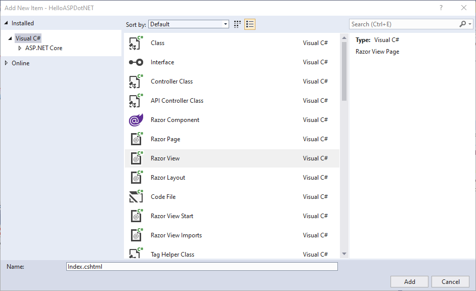

Creating a Template
====================

Using templates is a useful way to reduce the effort required to create and
maintain a web-based project. Before you can dive into using templates,
however, you need to take care of a little groundwork first.

Razor
-----

.. index:: ! Razor

**Razor** is a templating syntax included in the application framework for our MVC project. 
It allows us to write C# code directly into an HTML tree. 

More information on Razor can be found in this
`reference page <https://docs.microsoft.com/en-us/aspnet/core/mvc/views/razor?view=aspnetcore-3.1>`__.

For the most part, Razor templates look and operate just like
regular HTML code. Any C# logic we add to a template is preceded with 
the *at sign*, ``@``. You can open any template in a browser and view it just
like a static HTML file. Before we begin adding C# logic to Razor templates, we'll
first demonstrate creating a view using only HTML.

In this chapter, you will construct some small practice projects to help you
learn how to implement Razor templates. 

Hello Views
-----------

Before you start coding, we refactored ``HelloController``. Now ``Index()`` is responding to ``GET`` requests at ``localhost:5001/hello`` and ``Welcome()`` is only responding to ``POST`` requests at ``localhost:5001/hello``.
Check out the `views-starter <https://github.com/LaunchCodeEducation/HelloASPDotNETDemo/tree/views-starter>`__ branch of the ``HelloASPDotNETDemo`` repo to see how we refactored our code.

Open up your ``HelloASPDotNET`` project in Visual Studio and make sure you have committed any recent changes.
Make a new branch and code along with the following video.

.. admonition:: Warning

   In the videos in this chapter, we select the *View Page* type when creating a new view instead of *Razor View*.
   In this system, these are the same!
   However, it is good practice to make sure that you are selecting for a Razor view no matter what option you choose.

   The videos in this chapter walk you through building small web-based
   projects. Do NOT skip this practice, because the end of chapter exercises
   pick up where the tutorials end.

.. youtube::
   :video_id: mdrsb7yKGKs

.. admonition:: Note

   The starter code for this video is found at the `views-starter branch <https://github.com/LaunchCodeEducation/HelloASPDotNETDemo/tree/views-starter>`__
   of ``HelloASPDotNETDemo``. The final code presented in this 
   video is found on the `views-static branch <https://github.com/LaunchCodeEducation/HelloASPDotNETDemo/tree/views-static>`__.

.. index:: ! View() method

Controllers Return View Templates
^^^^^^^^^^^^^^^^^^^^^^^^^^^^^^^^^

So far, you've seen action methods in controller classes return ``Content`` objects
to render some view. Now, we pivot to another option. We mention in the introduction 
to controller classes that action methods can return HTML templates. Indeed, the 
``HomeController`` contains a few methods that do just that.

Out of the box, your MVC project contains several Razor templates within the ``Views`` directory.
The sub-directory ``Home``, found inside of ``Views``, contains the Razor templates returned from the 
``HomeController`` action methods. Just as an action method's name will map to a route with the same 
name, an action method's name can also correspond to a Razor template's name. The ``Index()`` method 
inside of ``HomeController`` returns the ``Index.cshtml`` template found inside of ``Views/Home``.

In order to return that template, the action method calls a **View() method**. The ``View()`` method finds 
a template that's associated with the particular controller and action method that it is called from. 

.. admonition:: Tip

   To override the default behavior of the ``View()`` method, you can pass in a 
   parameter which is the name of the template you want to render. For example, 
   if we want an action method named ``Form()`` to return a Razor template named 
   ``WelcomeForm.cshtml``, we have ``Form()`` return ``View("WelcomeForm");``.

Add a Template
^^^^^^^^^^^^^^

To create a template, we update ``HelloController.Index()`` to return a Razor template instead of a 
string of HTML. In ``Views``, create a new subdirectory called ``Hello``.

Within ``Hello`` create a new file of the *Razor View* file template. 

**WINDOWS USERS:** Right click on the ``Views`` directory or any subdirectory and select *Add -> New Item*. 
Avoid selecting *Add -> View* from your options. 

**MAC USERS:** Right click on the ``Views`` directory or any subdirectory and select *Add -> New File*.

**ALL USERS:** In the modal window that appears, look for the item labelled *Razor View*. 

   Select the *Razor View* file template.

Add the HTML form from the ``Index()`` method to your new template. Once you are done 
with that, update the ``Index()`` method to return ``View()``.

``_Layout.cshtml``
~~~~~~~~~~~~~~~~~~

When you re-render the app now, you'll notice some additional features and different styling.
There is a ``_Layout.cshtml`` file inside of the ``Views/Shared`` folder that provides some scaffolding 
for the application views. You can edit this file once and any other template will also render whatever 
elements you add to it. This can help give your application a polished, unified look and feel.
If you do not want to use this file, adding ``@{Layout = null;}`` at 
the top of the template will cause this shared layout template to be ignored.

Check Your Understanding
------------------------

.. admonition:: Question

   Which symbol is required to use C# code in a Razor template? 

   #. ``#``
   #. ``@``
   #. ``$``
   #. ``!``

.. ans: b, ``@``

.. admonition:: Question

   What is the file type for Razor templates?

   #. .razor
   #. .rzr
   #. .html
   #. .cshtml

.. ans: d, cshtml

