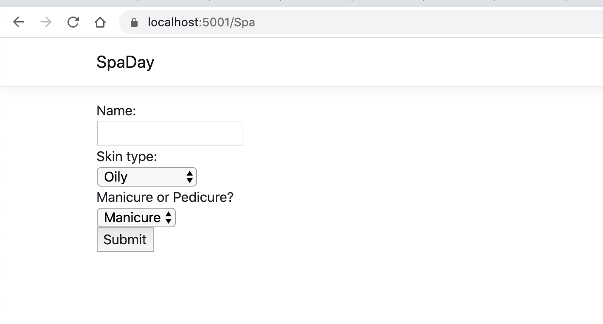
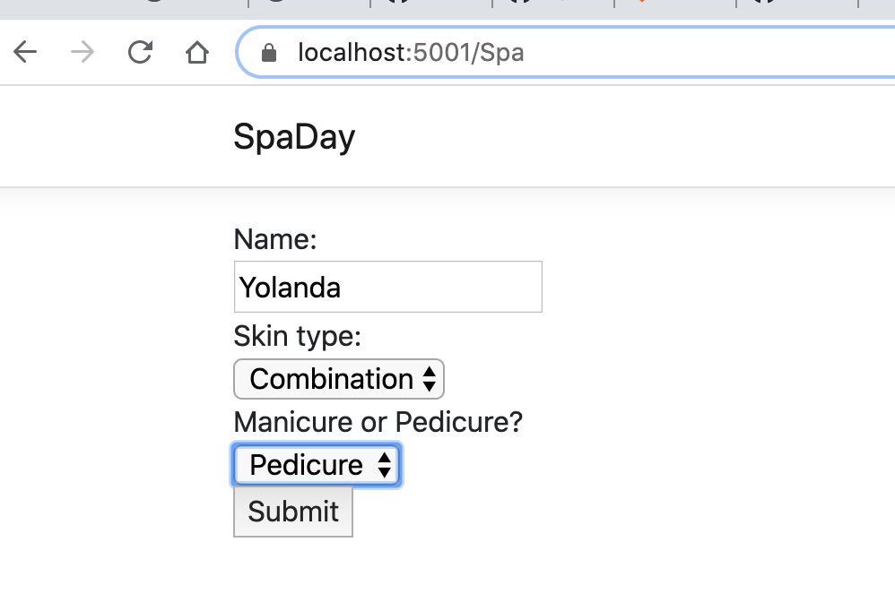
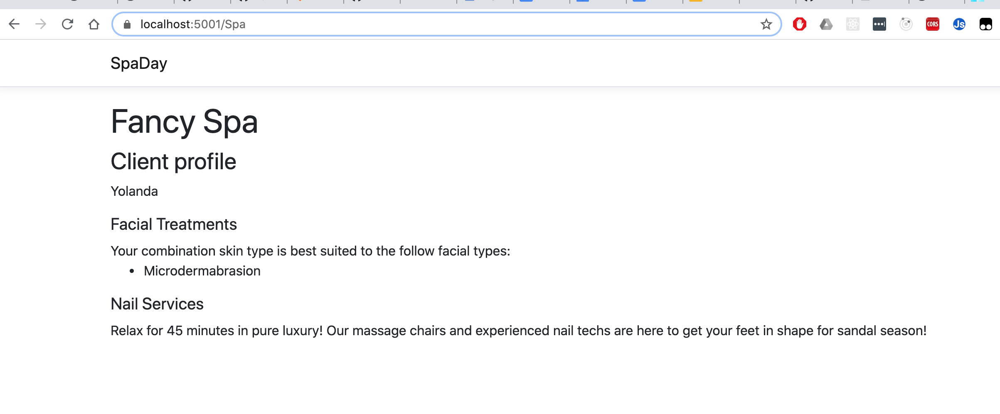

Studio: Spa Day!
================

After all of the hard work we have put into learning about Razor templates, it is
time for a spa day. Let's make an application to select some spa services.

Our application needs to do the following:

#. Display the user's name and skin type under their customer profile.
#. Display the appropriate facial treatments for their skin type.
#. Display the description of the spa's manicures or pedicures depending on the
   user's interest.

As always, read through the whole page before starting to code.

Setup
-----

Fork and clone the `starter code <https://github.com/LaunchCodeEducation/SpaDay>`_.
Check out the project via Version Control in Visual Studio.

.. admonition:: Tip

	**Windows Users**: You might need to change some solution settings if you pull down this demo repository and run it on your computer.
	Refer to :ref:`vs-troubleshooting` for help.

Once you have the project opened in your IDE, and run it and click the *SpaDay* link that appears in 
the upper left of the home page. You should see a small form at the ``/Spa`` route.

   The form located at ``/Spa``.

The Customer Profile
--------------------

In ``Controllers``, we have a controller called ``SpaController``. Inside
``SpaController`` are three methods.

#. ``CheckSkinType()`` method: Contains the logic to determine which facial treatments are appropriate for which skin type.
#. ``Index()`` action method: Returns the ``Spa/Index`` view when ``GET`` requests are made to ``/spa/``. 
#. ``Menu()`` action method: Returns the ``Spa/Menu`` view when ``POST`` requests are made to ``/spa/``.

In ``Views/Spa``, we have a Razor template called ``Menu``.
Inside ``Menu.cshtml``, there are two ``div`` elements.
Let's add some children to the ``div`` with the id, ``clientProfile``.

#. Add an ``h3`` that says "Client profile".
#. Next, display the value of the ``name`` parameter from the form. 

   .. admonition:: Tip

      This is a two step process. 

      #. In the controller, add a ``ViewBag`` property to hold the ``name`` value.
      #. In the view, use that ``ViewBag`` property to display the ``name`` in a ``p`` tag. 

Run the application and head to ``localhost:5001/spa`` to see the results. When we
fill out the form, we should see a new page with the client profile heading and name 
at the top.

List All Appropriate Facial Treatments
--------------------------------------

To provide treatment suggestions, ``SpaController.Menu()`` uses the ``CheckSkinType()`` method
and fills a list with facial treatments that benefit the user's skin type. Now, we just need to use Razor to
display the contents of the ``appropriateFacials`` list.

#. Add the client's ``skintype`` and the ``appropriateFacials`` list as a ``ViewBag`` property.

#. Now, head back to ``Menu.cshtml`` and checkout the empty ``div`` with the id,
   ``servicesMenu``. 

#. Pass in the ``skintype`` variable to the ``
`` tag.

#. Iteratively add the values in ``appropriateFacials`` to an unordered list. If you need a quick reminder of
   the syntax, review the :ref:`@foreach section <razor-foreach>` .

Mani or Pedi?
-------------

We want to display a description for the nail service the user selects.
Inside the ``servicesMenu`` div, use ``@if`` to determine if the value of 
``manipedi`` is ``"manicure"`` or ``"pedicure"``.

#. If the value of ``manipedi`` is ``"manicure"``, display this description:

      Our manicure is a great way to spend 30 minutes of your day! We use shea butter hand cream and the finest gel polish.

#. If the value of ``manipedi`` is ``"pedicure"``, display this description:

      Relax for 45 minutes in pure luxury! Our massage chairs and experienced nail techs are here to get your feet in shape for sandal season!

End Result
----------

After you are done with the studio, you should be able to fill out the form,
click "Submit", and see your profile page.

   A client completes the spa day form.

   The client's service menu.

Bonus Mission
-------------

#. Try adding an element to the bottom of the page with square
   shaped ``div`` elements. Each square should be a different color for
   different available nail polishes. At the base of the project is a folder called ``wwwroot``. 
   Inside of that is another folder called ``css``. Modify the ``site.css`` file inside of it to 
   get some CSS practice. There are already a number of style rules present so remember to be 
   give your ``div`` elements class identifiers to give your elements specificity. 
#. Modify the form to allow the user to select either a manicure or pedicure or
   *both*. If the user selects both, display both the manicure and pedicure
   descriptions in the ``Menu`` view.
#. Work with routes and paths to display the spa menu page on a separate route
   from the form.
