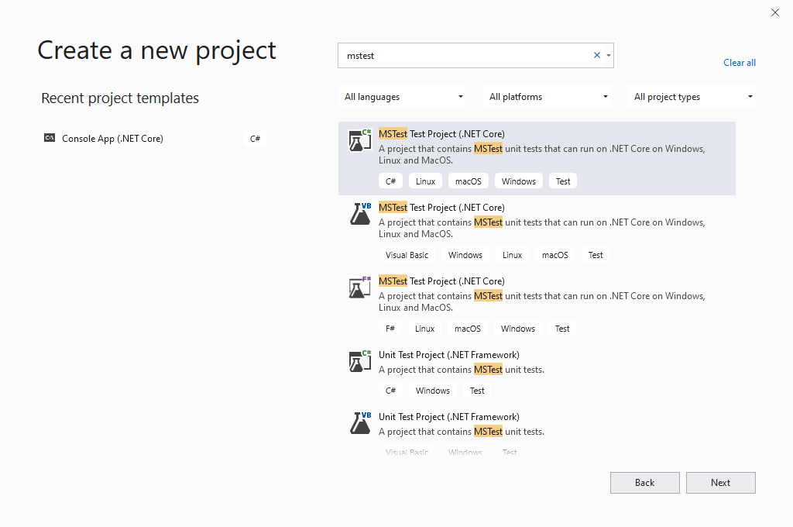
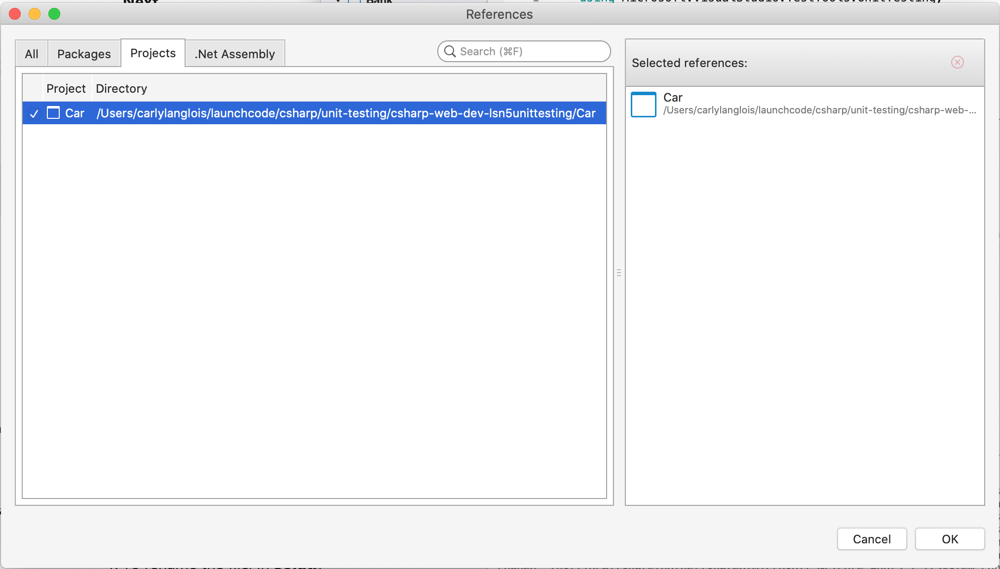
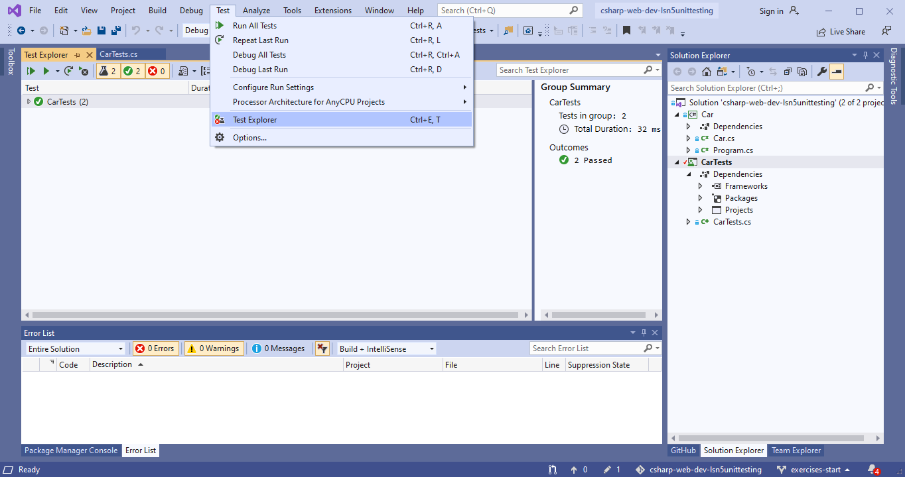

MSTest
======

MSTest is a framework that provides the methods and assertions
for writing and executing unit tests in C#. 

.. _csharp-attributes:

.. index:: ! TestClass, ! TestMethod

C# Attributes
-------------

.. index:: ! attributes

On the topic of unit testing, the attributes **[TestClass]** and **[TestMethod]** are used to 
indicate that certain classes and methods should be treated as test cases for the test runner 
in Visual Studio.

In C#, **attributes** are formalized bits of information about a program. They operate
somewhere between actual code syntax and a comment on the code. Attributes do not 
directly affect the code they annotate, but they do supply information to the compiler.
An attribute is enclosed in square brackets, ``[]``, and placed above the item it decorates. 
We will provide an example in the walkthrough below.

Testing Setup
-------------

.. index:: ! dependency

To test a simple .NET Core console project, we add a test project into the same solution with 
an MSTest dependency.

Fork and clone `this repo <https://github.com/LaunchCodeEducation/csharp-web-dev-lsn5unittesting>`__. Inside the solution, we have two projects,
``Car`` and ``CarTests``. The ``Car`` project is a simple .NET Console app like the others you have encountered
in this course so far. And ``CarTests`` is a new type of project, MSTest Project. 

On a Mac, to select this type of project looks like so:

.. figure:: ./figures/mac-create-mstest-project.png
   :alt: MAC: Create MSTest project

   MAC: Creating MSTest project in Visual Studio

On a Windows:

   WINDOWS: Creating MSTest project in Visual Studio

**MSTest** is a C# testing framework. When we create a Visual Studio MSTest Project, the 
necessary API and classes are added as **dependencies** of the ``CarTests`` project. A dependency 
is a separately developed program or piece of code that another program or piece of code 
uses to carry it out its function. Our C# tests will *depend* on MSTest code. 

Along the same lines, since ``CarTests`` tests the methods inside of ``Car``, we must add the 
``Car`` project as a dependency of ``CarTests``.

Right click on on the ``Dependencies`` directory in ``CarTests`` and add a reference to 
the ``Car`` project.

   Add main project as dependency for test project

``Car`` and ``CarTests``
^^^^^^^^^^^^^^^^^^^^^^^^

Open the ``Car`` class within ``main`` and look around. Here, we provide a class ``Car`` with basic 
information about a make, model, gas level, and mileage as well as getters, setters, and a few other methods. 

In the same project, the ``Program`` class contains a main method that prints the
``make`` and ``model`` of a given ``Car`` object. Run the project to verify it works.
Now, open ``CarTests``. It's empty, save for a few TODOs. Let's tackle the
first TODO to make a new empty test. Starting with an empty test lets us validate that we can 
use MSTest in our current environment.

.. index:: ! test runner

``[TestClass]`` and ``[TestMethod]``
------------------------------------

Another benefit of coding in an IDE, Visual Studio contains its own **test runner**. A test runner is 
simply a tool to execute tests and deliver their results. In order to indicate that ``CarTests`` contains
unit tests that we want the test runner to run, we must give it the ``[TestClass]`` attribute. As you might 
guess, ``[TestMethod]`` annotates a method to signal it as a test case. Both of these attributes come to us 
via the Visual Studio test runner.

In ``CarTests``, on top of ``public class CarTests``, add ``[TestClass]``. Then, create the following empty 
test underneath the first TODO. As usual, be sure write this code rather than copy/paste it:

.. sourcecode:: c#
   :linenos: 

   using Microsoft.VisualStudio.TestTools.UnitTesting;

   namespace CarTests
   {
      [TestClass]
      public class CarTests
      {
         //TODO: add emptyTest so we can configure our runtime environment
         [TestMethod]
         public void EmptyTest() {
            Assert.AreEqual(10,10,.001);
         }
         // ,,. other TODOs omitted here
      }
   }

Our empty test is aptly named ``EmptyTest()``, a description of its role. This test does 
not follow the AAA rule from our :ref:`testing-best-practices`, as it jumps straight to 
asserting. Nor is it relevant, for that matter. 

The three arguments in our test care defined as "expected", "actual", and "delta". This empty test 
asserts an expected value of ``10`` to equal an actual value of ``10``, 
with an accepted ``.001`` variance. 

.. admonition:: Note

   The third argument, called ``delta``, is the amount of allowed difference between the 
   expected and actual values. If the difference between the two values is within 
   that range, then the test still passes. 
   This argument is optional for some comparisons and required for others. One 
   scenario in which it is required is when comparing doubles. 

   Why is it required? Well, that's kind of a long story. Some number types are 
   `floating-point numbers <https://en.wikipedia.org/wiki/Floating-point_arithmetic>`__. 
   Due to the nature of their storage, these types carry with them a certain 
   degree of 
   `inaccuracy <https://en.wikipedia.org/wiki/Floating-point_arithmetic#Accuracy_problems>`__. 
   In brief, the ``delta`` argument ensures we can still reasonably compare two doubles.

.. admonition:: Tip

   Visual Studio can offer info on the parameters of previously defined function.
   Hover over the function call to see a tooltip:

   .. figure:: ./figures/function-parameters-tooltip.png
      :alt: Hover over a function to see its parameters

      Hover over a function to see its parameters

Of course, ``10`` equals ``10``. But let's run it so 
we know our test runner works. 

Mac Users: Running Tests
^^^^^^^^^^^^^^^^^^^^^^^^

For Mac users, run the ``CarTests`` project just like you would any other project. 

.. admonition:: Note

   If the panel does not open once the test are finished running, look for the *Test Results* panel on
   the side of your IDE and open it manually.

Windows Users: Running Tests
^^^^^^^^^^^^^^^^^^^^^^^^^^^^

For Windows users, you'll want to find and open the *Test Explorer* panel. If you don't already have it docked, 
you can find it listed in the top *Test* menu. 

      WINDOWS: Visual Studio open Test Explorer

With the panel open, select the *Run All Tests* option.

.. admonition:: Note

   If you see that the test fails to run, neither passing nor failing, you may need to adjust a setting to use
   64bit processing.

   .. figure:: ./figures/vs-windows-process-architecture-setting.png
      :alt: WINDOWS: Set Test Explorer to use x64 process

      WINDOWS: Set Test Explorer to use x64 process

All Users: Output and Adding More Tests
^^^^^^^^^^^^^^^^^^^^^^^^^^^^^^^^^^^^^^^

Once run, you'll see a new output panel with a green check mark indicating the test passed and a message 
stating the test passed. 

We know now how the test runner behaves when a test passes and can begin the real work of unit 
testing the ``Car`` class. To test the ``Car`` class, we must make it available to us by adding 
``using CarNS;`` to the top of your file.

Under your second TODO, write a test to verify that the constructor sets the 
``gasTankLevel`` field.

.. sourcecode:: c#
   :lineno-start: 16

   //TODO: constructor sets gasTankLevel properly
   [TestMethod]
   public void TestInitialGasTank()
   {
      Car test_car = new Car("Toyota", "Prius", 10, 50);
      Assert.AreEqual(10, test_car.GasTankLevel, .001);
   }

Here, we give the test a descriptive name, ``TestInitialGasTank()``, initialize a new 
``Car`` object, and test that the constructor correctly sets the ``gasTankLevel`` field.

Run ``CarTest`` to see that both tests pass. 

.. admonition:: Tip

   If you want to rerun only one test, right click on its listing in the results pane.

.. index:: ! [TestInitialize]

``[TestInitialize]``
--------------------

While ``[TestClass]`` and ``[TestMethod]`` are required to run tests, there are many other 
attributes you may find useful as your test files grow in scope. One such item to know
is **[TestInitialize]**. ``[TestInitialize]`` will run before each test method is run in a class. 

In the case of ``CarTest``, it would be nice to not need to create a new ``Car`` instance for 
each test we write. In your ``TestInitialGasTank()`` method, remove the line initiating ``test_car``. 
Above your relevant test, add the following ``[TestInitialize]`` method:

.. sourcecode:: c#
   :lineno-start: 16

   Car test_car;

   [TestInitialize]
   public void CreateCarObject()
   {
      test_car = new Car("Toyota", "Prius", 10, 50);
   }

Now, run the test project and ensure your test still passes.

.. index:: ! [TestCleanup]

``[TestCleanup]``
-----------------

``[TestCleanup]``, conversely, defines a set of conditions to be met after each test in a 
suite is run. 

.. admonition:: Note

   We won't encounter a scenario where we ask you to use ``[TestCleanup]`` in this class. As you explore writing 
   your own unit tests, you may find a yourself in a situation where you need or want it. One use case for 
   ``[TestCleanup]`` might be testing database transactions. You don't want changes to a database to persist 
   after test execution, so you can use ``[TestCleanup]`` to rollback, or reverse, a test transaction.

Common ``Assert`` Methods
-------------------------

In addition to the very commonly used ``Assert.AreEqual()`` method
you see above, here are a few other methods you should have in 
your unit testing playbook.

.. list-table:: MSTest Assert Methods
   :header-rows: 1

   + - Assertion
     - Description
   + - ``AreEqual(expected, actual, optional_delta)``
     - Asserts that two values, expected and actual, are equal to each other (optionally, within a given range of difference)
   + - ``IsFalse(condition)``
     - Asserts that a given condition is false
   + - ``IsTrue(condition)``
     - Asserts that a given condition is true
   + - ``IsNotNull(object)``
     - Asserts that a given object is not null

Checkout `the Assert class <https://docs.microsoft.com/en-us/dotnet/api/microsoft.visualstudio.testtools.unittesting.assert?redirectedfrom=MSDN&view=mstest-net-1.2.0>`__
for a full listing.

Check Your Understanding
-------------------------

.. admonition:: Question

   Write another version of ``TestInitialGasTank()`` using ``IsFalse()``, comparing the value to ``0``.

.. ans: Assert.IsFalse(test_car.GasTankLevel == 0);

.. admonition:: Question

   Write another version of ``TestInitialGasTank()`` using ``IsTrue()``.

..  ans: Assert.IsTrue(test_car.GasTankLevel == 10);

