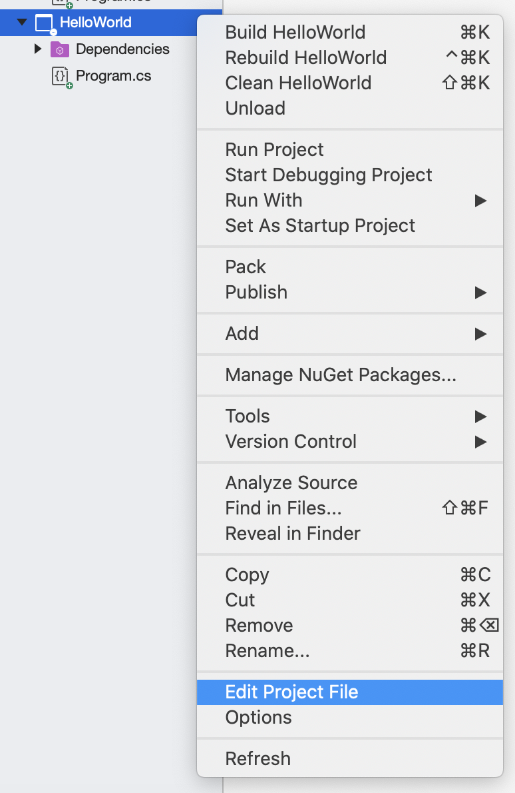

MSBuild
=======

.. index:: ! MSBuild, ! automated build tool

By now, you may have noticed a ``.csproj`` file in your C# project folders. This is a *C# Project* 
file type. It contains instructions on how to build the project. Visual Studio includes another 
Microsoft program called **MSBuild**.  MSBuild creates the code to build your application so that 
it can be run.

An **automated build tool**, such as 
MSBuild, is responsible for tasks like:

- Compiling the source code
- Managing dependencies
- Testing protocol
- Packaging the executable program for deployment

MSBuild is included in the Visual Studio IDE and has so far been doing its work under the radar. 
Other build tools are available for us to use in C# projects. However, like in the unit testing 
chapter, we will stick to the tools provided to us with the Visual Studio IDE.

.. index:: ! XML , ! Extensible Markup Language, ! MSBuild tasks, ! MSBuild targets, ! MSBuild properties, ! MSBuild items 

The Project File
----------------

The ``.csproj`` file is dynamically generated by MSBuild when the application is built. The file is 
written in **XML (Extensible Markup Language)**. XML is another member of the markup language 
family, like HTML. It is most often used for transferring data.

The four principal elements of a project file are:

#. **Tasks**: Units of executable code. Any build action that needs to take place will be done via tasks. 
   The other elements pass information into tasks.
#. **Targets**: Group and order related tasks for execution.
#. **Properties**: Key/value pairs used for build configuration information.
#. **Items**: Used to input resources, such as files, into the build system. 

So far, in our simple projects, there is not much complexity in what MSBuild and the ``.csproj`` 
file need to do. Our C# code is designed to be tested and executed within the IDE with very few 
dependencies. When you are working as a C# developer on the job, things will start to get more 
complicated. You will likely need at least three target environments for your 
application: 

a. debugging in the IDE. 
b. a development server for testing your deployed program before it is released to the user. 
c. the final production environment. 

You will also probably have a number of dependencies. These will have different responsibilities in those different environments. So while we don't do much with the project file yet, we will later on.
The four elements summarized above provide the details needed to manage larger projects.

To view a project file, right click on the project’s name in the Visual Studio file menu. From the dropdown menu, select *Edit Project File*.

   User selecting "Edit Project File".

Most of our project files from this class will look like this:

.. sourcecode:: XML

   <Project Sdk="Microsoft.NET.Sdk">
      <PropertyGroup>
         <OutputType>Exe</OutputType>
         <TargetFramework>netcoreapp3.1</TargetFramework>
      </PropertyGroup>
   </Project>

.. admonition:: Note

   At the time of writing, the version of .NET Core used is 3.1. If that is no longer the most 
	recent version, make note. Barring any major updates to the framework, the following 
	explanation still applies.

This project contains two property elements: ``OutputType`` and ``TargetFramework``. ``<OutputType>`` specifies the format of 
the build's output. ``OutputType`` is the key, and ``Exe`` is the value. This build outputs an ``.exe`` file. ``<TargetFramework>``
provides the version of .NET Core that the program uses. Both of these properties are wrapped in a ``<PropertyGroup>`` element. In 
fact, all property elements must be nested within a ``<PropertyGroup>`` tag. Finally, ``<Project>`` is a special element that 
forms the base of all project files. 

Check Your Understanding
------------------------

.. admonition:: Question

   What is the language of the C# project file?

   a. MSBuild

   b. C#

   c. csproj

   d. XML

.. ans: d, xml

.. admonition:: Question

   What is the element type used for the individual units of the build process?

   a. item

   b. task

   c. property

   d. target

.. ans: b, task

