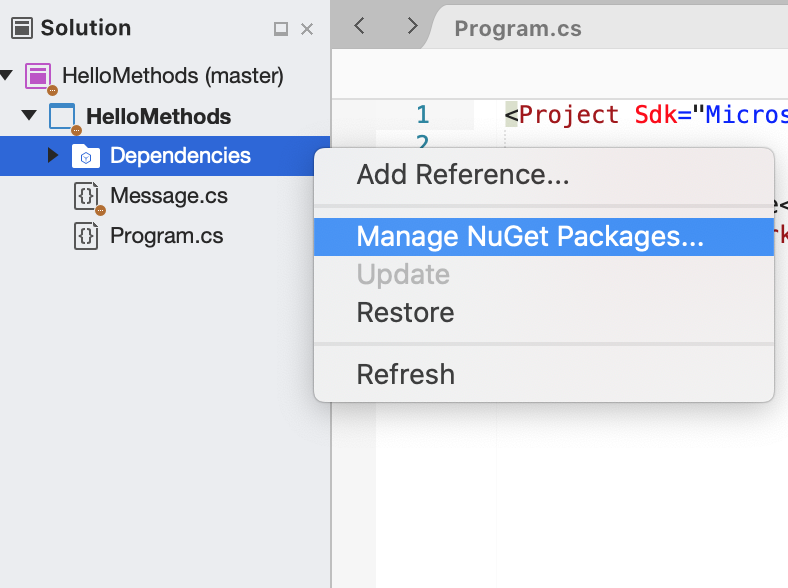
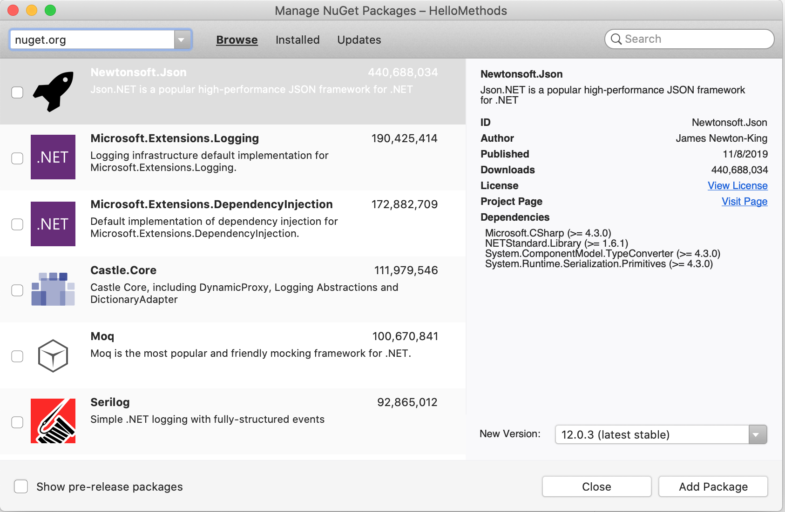

NuGet
=====

.. index:: ! NuGet

**NuGet** is a package management tool for .NET software. To use a dependency in a C# project, 
we can rely on NuGet to connect us with third-party code. NuGet allows us to bypass downloading 
and hosting the dependency library ourselves.
As with MSBuild, we will only scratch the surface of the utility of a .NET package manager. That 
said, it is still a good idea to get familiar with these tools. As your programs grow larger, 
MSBuild and NuGet will help to maintain a robust codebase.

NuGet packages are readily available within the IDE itself. Perhaps you have noticed the 
*Dependencies* directory that is created in our projects? To browse available packages, right 
click on that directory. From there, select “Manage NuGet Packages” from the dropdown menu:

   User selecting "Manage NuGet Packages".

The resulting window shows a catalog of software packages you may add to your project. 

   Browse available NuGet packages

NuGet allows you to use external code sources without including the codebase itself. You can make 
use of compiled libraries that other developers have already built. You can choose to use a 
specific version of a package hosted by NuGet, and update that version as need be. 

Check Your Understanding
------------------------

.. admonition:: Question

   Select which item best describes the job of NuGet.

   a. NuGet compiles your C# programs to be deployed in different conditions.

   b. NuGet is a marshmallow-like confection found in many candy bars.

   c. NuGet is a package manager for .NET programs.

   d. NuGet allows you to download dependency library source code into your solution.

.. ans: c, NuGet is a package manager for .NET programs.

.. admonition:: Question

   True/False: NuGet and MSBuild share responsibilities and only one is needed to deploy a C# app.

   a. True

   b. False

.. ans: False, While NuGet gives you access to the dependencies you need for your application, 
   MSBuild can configure how those dependencies are used in different executable environments.
