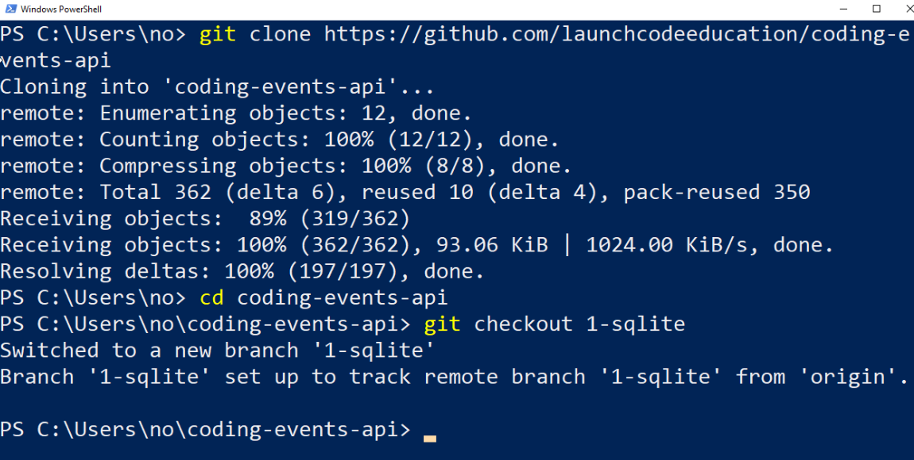
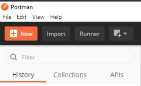
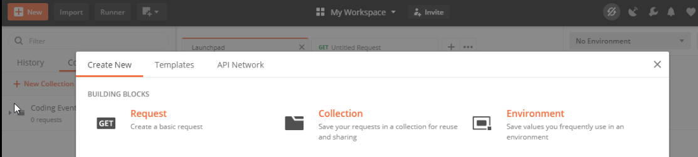
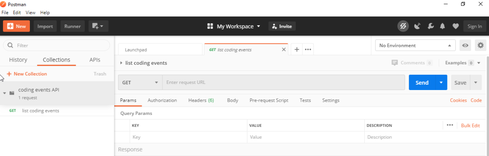
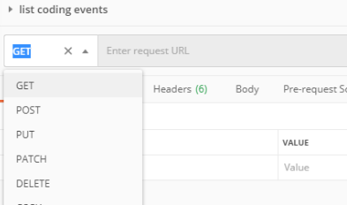
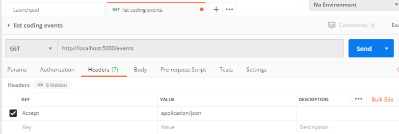
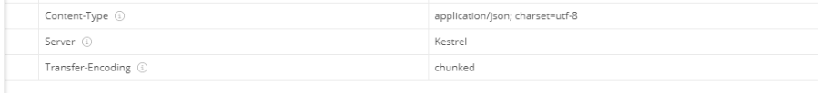
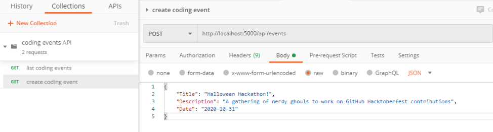
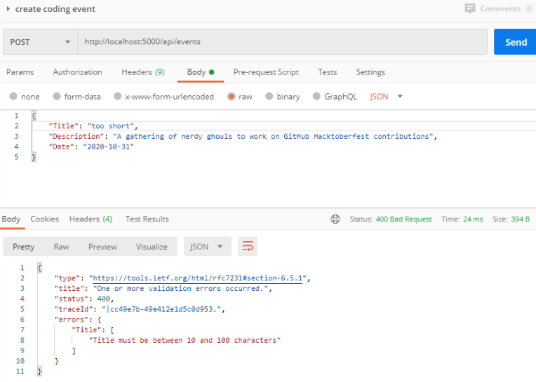
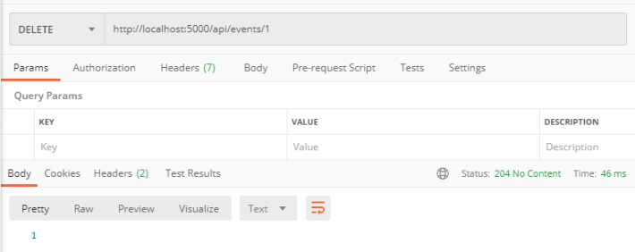

.. index:: ! Postman

.. todo: define headless API

Summary
~~~~~~~

Two endpoints at the ``CodingEvents`` entry-point path, ``/api/events``, to interact with the collection as a whole:

- **list CodingEvents**: ``GET /api/events -> CodingEvent[]``
- **create a CodingEvent**: ``POST /api/events (NewCodingEvent) -> 201, CodingEvent``

And two that require a sub-path variable, ``/events/{codingEventId}``, to interact with a single entity:

- **delete a CodingEvent**: ``DELETE /api/events/{codingEventId} -> 201, CodingEvent``
- **find single CodingEvent**: ``GET /api/events/{codingEventId} -> CodingEvent``

Studio: Consuming the Coding Events API With Postman
====================================================

The UI of a browser is designed to make simple ``GET`` requests for URLs entered into its address bar. This design works great for browsing sites, but 
falls short when working with headless APIs. Anything beyond a ``GET`` request is handled behind the scenes, such as when you ``POST`` a form or submit AJAX 
requests with JavaScript. But before you develop the client-side logic for making background requests, you need a way to interact with the API server 
directly and understand how it works.

When exploring and testing a web API, it is invaluable to have an interactive environment that allows you to fine-tune requests. For example, you may need 
to configure the HTTP method, headers, or body of the request -- all of which the browser does not allow you to do. Instead of the browser, we can use 
tools made specifically for interacting with APIs. One of the most popular API tools in the industry is **Postman**. Postman is a cross-platform tool that 
puts you in full control of configuring and executing API requests. In this studio, we work with Postman to explore how APIs can be consumed.

Setup
-----

.. todo: detail alt text

Fork and Clone the API Source Code
^^^^^^^^^^^^^^^^^^^^^^^^^^^^^^^^^^

We will be using a modified version of the MVC Coding Events application you created. The 
`Coding Events API <https://github.com/LaunchCodeEducation/coding-events-api/tree/1-sqlite>`_ is designed as a RESTful API. 
Although they are implemented differently, you will find that most of the features from the MVC application have been supported through endpoints in the 
API.

.. admonition:: Note

   Our focus in this course is on operations and as such we will not be going into the development of the API. However, feel free to explore the source 
   code if you are curious about the similarities and differences between the .NET MVC and API implementations.

Let's begin by forking and cloning the repo onto our machine. In your Powershell or terminal window, move into a directory were you plan to save your local
copy of the API codebase.

.. sourcecode:: bash

   > git clone https://github.com/<GitUsername>/coding-events-api

.. todo: explain sqlite usage, swagger docs, what the app looks like, which code to examine, what does running the application produce.

For today's studio, we will start with the first branch of the API codebase, ``1-sqlite``. This branch has an API with a single (``CodingEvent``) 
resource and a built-in SQLite database. 

Let's change into the repo and switch to this branch:

.. sourcecode:: bash

   # cd is an alias (like a nick-name) for the Set-Location cmdlet in PowerShell
   > cd coding-events-api

   # check out the 1-sqlite branch
   > git checkout 1-sqlite

You can leave this PowerShell window open, we will return to it in a later step:

   PowerShell in coding-events-api repo directory on 1-sqlite branch

.. todo: potentially break off here, top is exercises? bottom studio?

Making Requests to the Coding Events API
----------------------------------------

Start the API Server
^^^^^^^^^^^^^^^^^^^^

We'll start the API server from the terminal using the ``dotnet run`` command. Navigate to the ``CodingEventsAPI`` project folder *within* your 
``coding-events-api`` solution. This is the folder that contains ``Controllers/`` and so on, and is NOT the main project folder.

.. sourcecode:: bash

   # change to the CodingEventsAPI project directory
   > cd CodingEventsAPI

   # run the project
   > dotnet run

   info: Microsoft.Hosting.Lifetime[0]
      Now listening on: https://localhost:5001
   info: Microsoft.Hosting.Lifetime[0]
         Now listening on: http://localhost:5000
   info: Microsoft.Hosting.Lifetime[0]
         Application started. Press Ctrl+C to shut down.
   info: Microsoft.Hosting.Lifetime[0]
         Hosting environment: Development
   info: Microsoft.Hosting.Lifetime[0]
         Content root path: C:\Users\<username>\coding-events-api\CodingEventsAPI

.. todo : add note to describe the intended output

List the Coding Events
^^^^^^^^^^^^^^^^^^^^^^

Now that our API server is running, we can make our first request using Postman. To create a new request, select the *New* button in the top left corner:

   Postman New item button

Creating a New Request
^^^^^^^^^^^^^^^^^^^^^^

With the new item dialog open, select the *Create New* tab (on the left) then select *Request*. 

   Postman New item dialog

This will open the new request dialog:

.. figure:: figures/new-request-dialog.png
   :alt: Postman New Request dialog

   Postman New Request dialog

Postman requests require a name and a collection. A collection is just a container to hold related requests. They make it easy to import and export 
collections of requests for portability across teams. For our first request, enter the "list coding events" in the *Request name* form field. At the 
bottom of the new request dialog, you will see that the collections are empty. Select the orange *Create Collection* button then enter the 
name ``coding events API``. The new request dialog button will change to say *Save to coding events API*:

.. figure:: figures/new-request-dialog-complete.png
   :alt: Postman New Request save to collection

   Postman New Request save to collection

After saving, a new request tab will be created where you can customize its behavior:

   Postman new request tab

Configuring the Request
~~~~~~~~~~~~~~~~~~~~~~~

Postman exposes an exhaustive set of tools for configuring every aspect of a request. Fortunately, this request is relatively simple.

We want to request the state of the Coding Events collection, in shorthand:

``GET /api/events -> CodingEvent[]``

In Postman, we can make this request by configuring the following settings:

- the URL of the endpoint: ``http://localhost:5000/api/events``
- the HTTP method of the endpoint: ``GET``
- the request header: (``Accept: application/json``)

To the left of the URL bar is a dropdown selector for HTTP methods. It will default to ``GET``. In the following requests, you will need to select the 
appropriate method from this list. 

   Postman HTTP method selector

Next to the request method type, enter the request URL where the API request should be sent: ``http://localhost:5000/api/events``.

Underneath the URL bar are tabs for other aspects of the request. Select the ``Headers`` tab to configure our header. The ``Accept`` header lets the API 
know that we accept responses that are formatted as JSON. 

.. admonition:: Note

   In our context, the API only responds with JSON. However, some APIs offer multiple 
   `MIME types <https://developer.mozilla.org/en-US/docs/Web/HTTP/Basics_of_HTTP/MIME_types>`_ for their responses. It is a best practice to set this 
   header explicitly to the content type the consuming application expects.

You can set multiple headers in this section. As you begin to type the name and value of headers, Postman will autocomplete them for you. After 
configuration, your request should look like this:

   Postman list coding events request configured

To issue the request, you can select the blue *Send* button on the right of the window, or use the *ctrl + enter* keyboard shortcut. 

Viewing the Response
~~~~~~~~~~~~~~~~~~~~

Below the request configuration, you will see the response section has been populated. From here, you see the response body along with the status code 
(on the right) and a tab for headers:

.. figure:: figures/list-coding-events-response.png
   :alt: Postman list coding events responses

   Postman list coding events responses

Since this is our first time running the application, the database is empty. We expectedly received an empty JSON list ``[]`` which corresponds to the 
empty representation of the Coding Events collection.

If you select the *Headers* tab in the response pane, you see the API satisfied our ``Accept`` request header and provided the response in ``application/json`` format.

   Postman response headers

.. admonition:: Note

   If you get a connection refused error, it means you likely forgot to start the API server or mistyped the URL. Check both of these before attempting 
   the request again.

   .. figure:: figures/connection-refused.png
      :alt: Postman request connection refused error

      Postman request connection refused error

Create a Coding Event
^^^^^^^^^^^^^^^^^^^^^

For our next request, we will create a Coding Event. Repeat the steps you performed in the previous request:

#. Click on the orange *New* button in the top left corner to create a new request named: ``create coding event``
#. Add it to the existing ``coding events API`` collection

This request will change the state of the Coding Events collection by adding a new entity to it. Recall that the shorthand for this request is:

``POST /api/events (NewCodingEvent) -> 201, CodingEvent``

We will need to set the following request settings:

#. The URL of the endpoint: ``http://localhost:5000/api/events``
#. The HTTP method of the endpoint: ``POST``
#. The request header: (``Content-Type`` ``application/json``)
#. The request body: a JSON ``NewCodingEvent`` object

As a best practice, we explicitly define the ``Content-Type`` header. This header indicates that our request contains ``application/json`` data so that 
the API knows how to parse the incoming request body. 

Configure the Request Body
~~~~~~~~~~~~~~~~~~~~~~~~~~

In addition to the configurations you are now familiar with setting, we will need to define the request body. For this task, select the *Body* tab that 
is next to *Headers*. 

The body of the request must be in a raw JSON format. In the *Body* tab, open the the dropdown to select your data format. Select *raw* from the menu. Once 
this format is selected, enter the following JSON body:

.. sourcecode:: bash
   :linenos:

   {
      "Title": "Halloween Hackathon!",
      "Description": "A gathering of nerdy ghouls to work on GitHub Hacktoberfest contributions",
      "Date": "2020-10-31"
   }

Before sending the request, check that your configuration matches the following image:

   Postman create coding event request configuration

Hit send and we'll take a look at the result.

Analyzing the Response
^^^^^^^^^^^^^^^^^^^^^^

You can see in the response that the API reflected back the representation of the new ``CodingEvent`` entity. Notice that a unique ``id`` has been 
assigned to it by the API. Looking at the status code (``201``) and headers of the response, we can see the API conformed to the REST convention. Open the *Headers*
tab in the response panel. The URL value of the ``Location`` header is: ``http://localhost:5000/api/events/1``. This location can be can now be used to 
view the individual ``CodingEvent`` entity that was created by our request.

Sending a Bad Request
^^^^^^^^^^^^^^^^^^^^^

To illustrate the rejection of bad requests, let's send one that violates the ``NewCodingEvent`` validation constraints. Send another request with the 
following JSON body:

.. sourcecode:: bash

   {
      "Title": "too short",
      "Description": "A gathering of nerdy ghouls to work on GitHub Hacktoberfest contributions",
      "Date": "2020-10-31"
   }

You can see from the response that the API rejected the request. The response returns a bad request status of ``400`` which indicates a client-side error. 
The response body includes information about what needs to be corrected to issue a successful request:

   Postman response of create coding event with a bad request body

Get a Single Coding Event
^^^^^^^^^^^^^^^^^^^^^^^^^

For this step, we will make a request for the state of a single entity. You can use the URL from the ``Location`` header of the previous request to 
complete this task. Remember to follow the steps you performed before, keeping in mind the shorthand for this request:

``GET /api/events/{codingEventId} -> CodingEvent``

#. Create a new request named: ``get a single coding event``
#. Add it to the existing ``coding events API`` collection
#. Configure the URL of the endpoint: ``http://localhost:5000/api/events/1``
#. Configure the HTTP method of the endpoint: ``GET``
#. Configure the request header: (``Accept: application/json``)

You should get back the following JSON response body:

.. sourcecode:: bash
   :linenos:

   {
      "id": 1,
      "title": "Halloween Hackathon!",
      "description": "A gathering of nerdy ghouls to work on GitHub Hacktoberfest contributions",
      "date": "2020-10-31T00:00:00"
   }

Requesting a Non-Existent Entity
~~~~~~~~~~~~~~~~~~~~~~~~~~~~~~~~

Our REST API allows us to interact with the state of its resources. If we make a request for a resource that doesn't exist in this state, we expect a 
``404`` (not found) response. 

Try issuing the request again with a non-existent ``codingEventId`` of ``100``. You should get back the following response:

.. figure:: figures/404-response.png
   :alt: Postman 404 response for a non-existent resource

   Postman 404 response for a non-existent resource

Delete a Coding Event
^^^^^^^^^^^^^^^^^^^^^

In this final step, we will issue a ``DELETE`` request. Before we make the request, let's re-issue the request to list Coding Events. Now that we have 
added an entity, we expect the state of the Coding Events resource collection to have changed. Switch back to the ``list coding events`` request tab and 
re-issue the request. You should get a response of the collection's list representation containing the new entity.

.. sourcecode:: bash
   :linenos:

   [
     {
        "id": 1,
        "title": "Halloween Hackathon!",
        "description": "A gathering of nerdy ghouls to work on GitHub Hacktoberfest contributions",
        "date": "2020-10-31T00:00:00"
     }	
   ]

To delete this entity, and therefore change the state of our resources, we will need to issue the following shorthand request:

``DELETE /api/events/{codingEventId} -> 204``

Once again, go through the methodical process of setting up the request:

#. Create a new request named: ``delete a coding event``
#. Add it to the existing ``coding events API`` collection
#. Configure the URL of the endpoint: ``http://localhost:5000/api/events/1``
#. Configure the HTTP method of the endpoint: ``DELETE``

Notice that for this request, we do not need to set any request headers. A ``DELETE`` request should send back an empty (``no-content``) response body 
with its ``204`` status code. 

   Postman delete a coding event response

As a final confirmation, check the state of the Coding Events collection and notice that it has returned to its initial state. The representation of this 
state is shown in the empty list ``[]`` response body.

Bonus Missions
--------------

If you complete this studio early and want some additional practice, consider the following bonus missions:

- Explore the API source code using your IDE debugger to step through the request and response process
- Try consuming the API from the command-line using the Bash `curl <https://linuxhint.com/curl_bash_examples/>`_ program or the PowerShell 
  `Invoke-RestMethod <https://docs.microsoft.com/en-us/powershell/module/microsoft.powershell.utility/invoke-restmethod?view=powershell-7>`_ cmdlet.

